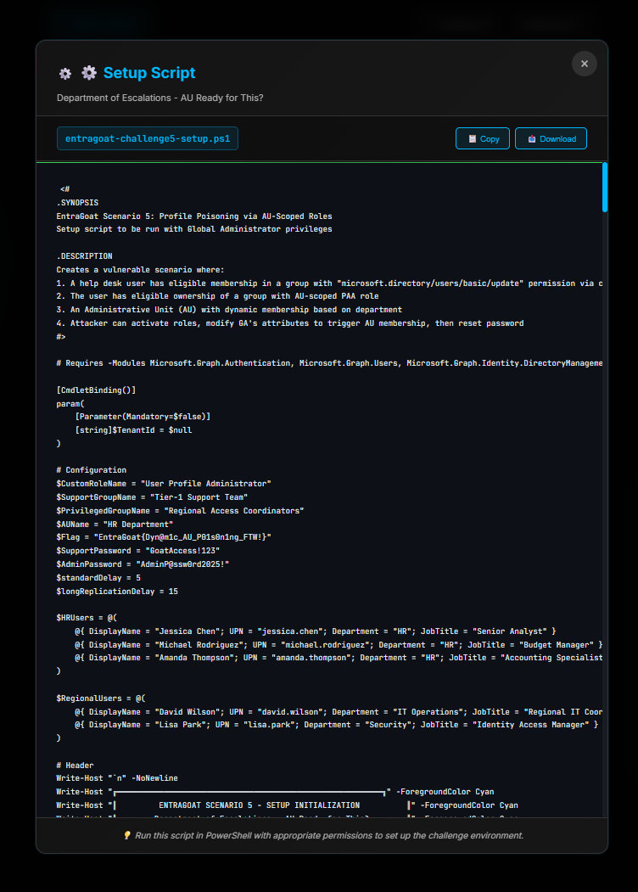

# **Getting Started with EntraGoat: Breaking Entra ID the Smart Way**

[**EntraGoat**](https://github.com/Semperis/EntraGoat/) is a deliberately vulnerable lab that simulates real-world identity misconfigurations in Microsoft Entra ID. Whether you're a red teamer, blue teamer, or just curious about identity attacks, this guide will walk you through how to set up EntraGoat, launch your first challenge, and start capturing flags like a pro.

## What is EntraGoat?

Imagine a playground where you can:

* Escalate a user to Global Admin
* Chain permissions via the Graph API
* Abuse misconfigured apps and service principals
* Activate privileged roles to reset global admin’s MFA
* Simulate attacks without endangering production environments

That’s exactly what **EntraGoat** offers: a CTF-style platform for identity exploitation learning in the cloud (*Figure 1*).

*Figure 1. EntraGoat’s dashboard shows your challenge progress*

## Getting started with EntraGoat: What you need

Before we get our hooves dirty, here’s what you need:

* A **test Microsoft Entra ID tenant** (*E5 trial* works great)
* **Global Administrator** privileges in that tenant
* **Node.js + npm** installed
* **PowerShell 7+**
* Microsoft Graph PowerShell SDK (*Figure 2*)

*Figure 2. Installing Graph with PowerShell*

## Step 1: Clone and launch the lab

Fire up your terminal and run the script that *Figure 3* shows.

*Figure 3. Cloning the EntraGoat lab*

Then open your browser to: <http://localhost:3000>

As *Figure 4* shows, each challenge comes with a backstory, credentials, hints, and a place to submit the flag.

*Figure 4. EntraGoat challenge framework*

## Step 2: Launch your first challenge

Once the EntraGoat dashboard is live at <http://localhost:3000>, you can launch any scenario using either of **two methods.**

### Option 1: Download and deploy via web interface

1. From the dashboard, click on a challenge (e.g., Scenario 1: Misowned and Dangerous).
2. In the **Challenge View**, click:
   1. **View Setup Script** -> Download the setup script
   2. **View Cleanup Script** -> Download the cleanup script (optional)
3. Run the downloaded PowerShell script from your terminal

Each challenge page lets you download setup and cleanup scripts directly (*Figure 5*).

*Figure 5. EntraGoat setup script*

Once, you’ve downloaded the setup script, run the scenario using the setup command (*Figure 6*).

*Figure 6. Running Scenario 1 from the GUI*

### Option 2: Run directly from the Scenarios folder

If you cloned the repo locally, you can skip downloading and run the scripts straight from the terminal (*Figure 7*).

*Figure 7. Running Scenario 1 from the terminal*

Either method sets up the same environment. Use what fits your workflow, GUI-first or terminal-only.

## Step 3: Explore, attack, escalate

You now have:

* Valid user credentials
* A vulnerable, misconfigured Entra ID environment
* And... a flag hidden under the admin properties. Get it after you sign in as a Global Administrator.

Use the Azure portal, Microsoft Entra admin center, Microsoft Graph PowerShell, or Graph Explorer to:

* Enumerate user-linked resources
* Check for ownership over apps or groups
* Review assigned roles and privileged eligibility pathways

If you’re stuck, use the in-platform hints to guide your thinking. They’re designed to support attacker-style reasoning without disclosing full solutions.

## Step 4: Capture the flag

Your objective is to retrieve the flag after gaining Global Administrator access, validating the scenario’s intended impact.

EntraGoat{SP\_0wn3rsh1p\_Pr1v\_Esc@l@t10n\_Congratz!}

Paste the flag into the challenge page and mark the challenge complete! Then, you’ll get access to the next one.

**NOTE:** By default, all authenticated users in Entra ID can query basic profile data of other users, and attributes like extensionAttribute1–15 aren’t classified as sensitive. As a result, the flag stored in the Admin’s profile can technically be retrieved immediately with the API query that *Figure 8* shows.

*Figure 8. Shortcut to flag retrieval*

This behavior is intentional. The goal of EntraGoat is not to hide the flag but to demonstrate realistic privilege escalation techniques in Entra ID environments. Retrieving the flag via a direct API call is possible; but the real objective is to escalate privileges, access the Azure portal as the admin user, and view the flag in their UI, demonstrating full control over a Global Administrator identity (*Figure 9*).

The flag is a gamified artifact to validate completion, not the primary objective of the scenario.

*Figure 9. Taking steps to escalate privileges [a better description for this caption?]*

## Step 5: Clean it up

After each scenario, you can roll back the changes (*Figure 10*).

*Figure 10. Cleaning up after Scenario 1*

No messy leftovers in your tenant.

## Want to go deeper?

Each scenario comes with a complete **walkthrough script** and **step-by-step solution file** you can use to:

* Teach others
* Understand the mechanics behind each attack path
* Automate your tests
* Build new attack chains

You’ll find them under: */solutions/*

## Learn, practice, and defend with EntraGoat

EntraGoat is more than a lab environment. It provides an on-demand platform to explore Entra ID attack paths, develop effective defense strategies, and apply that knowledge to strengthen real-world environments.

[**Get EntraGoat**](https://github.com/Semperis/EntraGoat) and explore it yourself. Use it to do good.

## Keep going with EntraGoat

Disclaimer

This content is provided for educational and informational purposes only. It is intended to promote awareness and responsible remediation of security vulnerabilities that may exist on systems you own or are authorized to test. Unauthorized use of this information for malicious purposes, exploitation, or unlawful access is strictly prohibited. We do not endorse or condone any illegal activity and disclaims any liability arising from misuse of the material. Additionally, We do not guarantee the accuracy or completeness of the content and assumes no liability for any damages resulting from its use.
