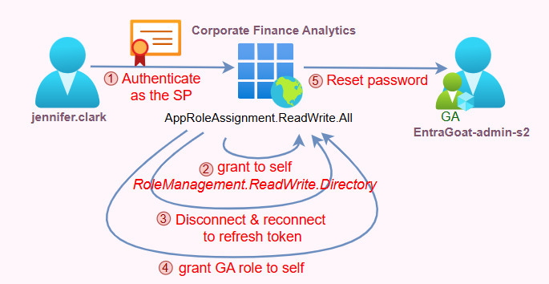

## Graph Me the Crown (and Roles)

EntraGoat Scenario 2 demonstrates how certificate-based authentication tied to an existing service principal and overprivileged application permissions can lead to Global Administrator compromise.

The attacker starts with access to a leaked certificate that was exposed through continuous integration/continuous delivery (CI/CD) pipeline artifacts. The certificate is valid for a service principal that has the AppRoleAssignment.ReadWrite.All application permission.

By authenticating in an app-only context, the attacker abuses this permission to assign another permission, RoleManagement.ReadWrite.Directory, to the same service principal. This enables the service principal to self-assign any directory role (including Global Administrator) to any service principal it wishes. Finally, the attacker resets the admin’s password and retrieves the scenario flag.

This scenario emphasizes the risks of certificate sprawl, overprivileged Graph scopes, and the nature of app-only tokens. It also highlights the distinction between permission enforcement via token claims vs. real-time directory evaluation, which we’ll explain in this walkthrough.

### Attack path overview

1. **Initial foothold**: The attacker obtains a base64-encoded certificate and its password, reportedly leaked through CI/CD pipeline reconnaissance.
2. **Identification**: The certificate matches an existing service principal named Corporate Finance Analytics.
3. **Permission abuse**: The attacker authenticates using the certificate and discovers that the service principal has AppRoleAssignment.ReadWrite.All application permission.
4. **Privilege escalation**: The attacker uses this permission to assign RoleManagement.ReadWrite.Directory to the same service principal.
5. **Role takeover: With directory role management access, the attacker adds the service principal as a member of the Global Administrator directory role.**
6. **Account compromise**: The attacker resets the Global Admin user’s password and authenticates to retrieve the flag.

### Attack flow

*Figure 1* shows the flow of this attack.



*Figure 1. Flow of the Graph Me the Crown (and Roles) attack scenario*

### How does this attack bypass normal authentication controls?

This scenario abuses Microsoft Entra ID’s application model, where apps consist of a global registration and a tenant-local service principal. App-only permissions are **requested** at the application registration level and **granted** at the service principal level. In addition, service principals can authenticate independently of users using the OAuth 2.0 client credentials flow.

When a valid certificate is registered for a service principal (at its keyCredentials.customKeyIdentifier property), it can be used to authenticate without interactive input or multifactor authentication (MFA). This app-only authentication path operates outside user-centric protections, allowing a compromised certificate to directly access Graph APIs with the permissions or roles assigned to the service principal.

This attack path combines:

* Weak certificate hygiene (less relevant for Entra ID)
* Excessive and unmonitored app permissions
* The intentional design of AppRoleAssignment.ReadWrite.All to bypass\* the admin consent experience in app-only contexts

By chaining these conditions, attackers can authenticate as a service principal, escalate to sensitive Graph scopes like RoleManagement.ReadWrite.Directory to grant themselves a privileged role (up to Global Administrator) without ever touching a user session after they gained the service principal’s credentials.

\_\_\_\_

**Note:** Additional attack paths can be chained to this one, as any identity with Application Administrator or Cloud Application Administrator roles, or any service principal with the Application.ReadWrite.All app role or ownership over the target service principal—as demonstrated in Scenario 1—can also take advantage of this attack path by adding credentials for backdoor access to the service principal.

\_\_\_\_

Finally, it’s important to distinguish between **different uses of certificate-based authentication** (CBA). When CBA configuration is disabled at the tenant level, that restriction applies only to interactive user authentication—not OAuth client assertions flow for applications. Service principals can still authenticate using certificates if a valid credential is registered in their KeyCredentials property. Entra ID treats this as a separate authentication mechanism. This architectural decoupling may lead to false assumptions about the enforcement of tenant-wide certificate policies.

\*In fact, this permission doesn't "bypass" admin consent - it **IS** admin consent. The permission itself requires admin consent to be granted initially, then enables the holder (and adversaries, of course) to **programmatically grant consent to other applications** as part of machine-to-machine interaction.

### How to detect and defend against misuse of app-only authentication

Defensive posture in Entra ID must focus on restricting the use of broad app permissions and closely monitoring service principals that hold sensitive roles like AppRoleAssignment.ReadWrite.All and RoleManagement.ReadWrite.Directory.

Security teams should:

* Regularly audit service principals for high-privilege app roles
* Track creation of new credentials on service principals, especially when done outside approved automation
* Detect changes to app role assignments that could allow privilege escalation

## Scenario deep dive: Step-by-step solution walkthrough

Let’s take a look at the steps to simulate bypass of authentication controls and understand how it enables Global Admin compromise.

### Step 1: Initial foothold with a compromised certificate

We begin Scenario 2 with a compromised certificate (*Figure 2*), allegedly dumped during CI/CD pipeline reconnaissance. It's base64-encoded, password-protected, and left behind like cargo falling off a DevOps truck.


*Figure 2. A compromised certificate, dumped in our lap*

To identify the owner of the certificate, we first decode it into a usable X509Certificate2 object and inspect its metadata:

```powershell
$certBase64 = "[BASE64\_CERTIFICATE\_BLOG]"

$certPassword = "GoatAccess!123"

$certBytes = [System.Convert]::FromBase64String($certBase64)

$cert = New-Object System.Security.Cryptography.X509Certificates.X509Certificate2($certBytes, $certPassword, [System.Security.Cryptography.X509Certificates.X509KeyStorageFlags]::Exportable)

$cert | Select-Object Subject, Issuer, Thumbprint, NotBefore, NotAfter | Format-List
```

We can see that the certificate is self-signed and issued for an app called Corporate Finance Analytics (*Figure 3*).


*Figure 3. Identifying the app our certificate is issued for*

Alternatively, we can iterate through all application registrations in the tenant and search for a matching certificate thumbprint. Each application object in Entra ID has a KeyCredentials attribute, which holds metadata about certificates or public keys associated with the app that is used for authentication in app-only contexts. Each entry includes a CustomKeyIdentifier, which stores the certificate's thumbprint (*Figure 4*) in binary form and allows for lookup or correlation against known certificates.


*Figure 4. Certificate thumbprint*

The following function can perform the search:

```powershell
function Find-AppRegistrationByThumbprint {

    param([string]$Thumbprint)

    # Get all application registrations and check for matching certificate thumbprint

    $allApps = Get-MgApplication -All

    foreach ($app in $allApps) {

        if ($app.KeyCredentials) {

            foreach ($keyCred in $app.KeyCredentials) {

                # Compare thumbprints (certificate matching)

                if ($keyCred.CustomKeyIdentifier) {

                    $credThumbprint = [System.Convert]::ToHexString($keyCred.CustomKeyIdentifier)

                    if ($credThumbprint -eq $Thumbprint) {

                        Write-Host "Certificate match found for: $($app.DisplayName)" -ForegroundColor Cyan

                        return $app

                    }

                }

            }

        }

    }

    return $null

}
```


Microsoft Graph never stores or returns the actual certificate content or private keys. Querying the KeyCredential attribute using Graph API only reveals the registered certificate metadata, never the certificate itself, no matter how high the privileges the requesting identity has. This reinforces the critical need for secure handling and storage of private keys throughout the organization.

To identify the associated service principal, we authenticate as the low-privileged user using Connect-MgGraproh. Once we extract the AppId behind Corporate Finance Analytics (*Figure 5*), we are able to authenticate directly as the service principal with the certificate.


*Figure 5. Extracting the AppId*

\_\_\_\_\_\_\_\_\_

**Note**: Although **CBA is** **disabled** in the tenant (*Figure 6*), authentication to the service principal using the certificate will still succeed. This is because **user-based CBA refers to an interactive, browser-based sign-in experience, while service principals rely on a non-interactive OAuth 2.0 client credentials flow using certificate assertions.** Disabling CBA affects only interactive user authentication with certificates and has no impact on programmatic service principal authentication. These are separate authentication paths in the Entra ID platform.


*Figure 6. CBA is disabled in this Entra ID tenant*

\_\_\_\_\_\_\_\_\_

### Step 2: Discovering app permissions and building our attack path

After authenticating as the service principal using the certificate, we check its roles claim in the granted JWT via the Get-MgContext command and discover that it holds AppRoleAssignment.ReadWrite.All (*Figure 7*).This permission allows the service principal to assign ANY application roles across all service principals—including to itself.


*Figure 7. Checking the service principal’s roles claim*

To escalate, we enumerate the Microsoft Graph service principal (GraphAggregatorService), which contains all assignable OAuth roles and is present in every Entra tenant as a first-party application. It’s instantiated from a global application registration hosted in Microsoft’s own tenant and can be identified by the static AppId of 00000003-0000-0000-c000-000000000000. Like all multi-tenant applications, it appears in each customer tenant as a **local service principal—**the actual identity used to enforce access control. (We touched on the Entra ID application model in Scenario 1.)

The AppId in *Figure 8* points to the global definition of Microsoft Graph, which contains all assignable OAuth roles that define app-only permission scopes like Directory.Read.All or RoleManagement.ReadWrite.Directory. Each tenant holds a local service principal instance of the global app, and **OAuth permissions are assigned at the service principal level** via AppRoleAssignment. This allows applications to operate independently of users, with the scopes defined in the global app manifest but enforced by the tenant-local service principal.


*Figure 8. Enumerating Graph’s assignable OAuth permissions*

**Fun fact:** There are currently 576 unique Graph permissions!

Now that we've located the Microsoft Graph service principal and have its assignable OAuth permissions, the next step is choosing **which permission to escalate with**. The most impactful for our attack purpose is RoleManagement.ReadWrite.Directory, according to a note on the official [documentation](https://learn.microsoft.com/en-us/graph/permissions-reference#rolemanagementreadwritedirectory):


*Figure 9. Microsoft’s warning about permissions that allow granting authorization*

This level of access is **dangerous by design**. It gives full programmatic control over Entra ID role management APIs and supports direct privilege escalation without user interaction.

### Step 3: Assigning dangerous permissions

We can assign this permission to our compromised service principal using the following commands:

```powershell
$roleManagementRole = $graphSP.AppRoles | Where-Object { $\_.Value -eq "RoleManagement.ReadWrite.Directory" }

$appRoleAssignmentParams = @{

    PrincipalId = $SP.Id

    ResourceId = $graphSP.Id

    AppRoleId = $roleManagementRole.Id

}

New-MgServicePrincipalAppRoleAssignment -ServicePrincipalId $SP.Id -BodyParameter $appRoleAssignmentParams
```

After this command has been executed—although we successfully granted the service principal the RoleManagement.ReadWrite.Directory permission, as inspected by Get-MgContext—we observe no change in the current security context (*Figure 10*). This is an expected behavior.


*Figure 10. Observing no change in the service principal’s security context*

Access tokens issued by Entra ID are like **static snapshots** of claims granted **at the time the token was issued**. When Connect-MgGraph is executed, it acts as an OAuth2.0 client and initiates an authentication flow against the token endpoint (https://login.microsoftonline.com/{tenant-id}/oauth2/v2.0/token). This endpoint validates the presented credentials and issues a signed JWT access token for it with the caller’s claims (like app roles, scopes, and tenant context) based on the current authorization state at the time of request.

Because access tokens are **not dynamically refreshed** when permissions change, newly granted app roles (like the one we just added) won’t show up until a new token is explicitly obtained. To get the updated privileges, we have to terminate the existing session (Disconnect-MgGraph) and re-authenticate to it (Connect-MgGraph) to trigger the issue of a fresh access token that includes the new claims (*Figure 11*).


*Figure 11. Triggering the issue of a fresh access token*

With the RoleManagement.ReadWrite.Directory permission granted, the service principal we have can now **modify directory role assignments** **for any identity** in the tenant—including adding itself to the Global Administrator role:

```powershell
$globalAdminRoleId = "62e90394-69f5-4237-9190-012177145e10" # GA role GUID

$globalAdminRole = Get-MgDirectoryRole -Filter "roleTemplateId eq '$globalAdminRoleId'" -ErrorAction SilentlyContinue

$roleMemberParams = @{

    "@odata.id" = "https://graph.microsoft.com/v1.0/servicePrincipals/$($SP.Id)"

}

New-MgDirectoryRoleMemberByRef -DirectoryRoleId $globalAdminRole.Id -BodyParameter $roleMemberParams

```

Now, if we check the assigned roles the compromised service principal has, we will be able to see the GUID of the Global Administrator (*Figure 12*).


*Figure 12. Viewing the Global Administrator’s GUID*

If you followed closely, a key behavioral difference may stand out:

**Why is it necessary to obtain a new JWT for the identity after granting an app permission but not after assigning a directory role?**

The answer lies in how Entra ID enforces these two models of authorization:

* **Application permissions** (such as RoleManagement.ReadWrite.Directory) are issued as static claims within the JWT access token at the time of authentication. These permissions are represented in the roles array claim (or scp in delegated flows). The token is in fact a cryptographically signed assertion reflecting the caller’s app roles and scopes at issuance and usually any changes to these permissions require token reissuance.
* **Directory roles** (such as Global Administrator) are also issued as static claims within the access token but follow a different enforcement model. While tokens can include directory role assignments via the wids claim or the group claim (in case of group membership), most Microsoft APIs ***usually*** evaluate these roles dynamically at runtime. When a request is made, the backend queries the current role assignments in Entra ID for the caller’s object ID. This real-time lookup allows newly assigned roles to take effect immediately without requiring token renewal.

With that being said, Microsoft explicitly notes in its [access token claims reference](https://learn.microsoft.com/en-us/entra/identity-platform/access-token-claims-reference) documentation that:

>“The *roles*, *groups*, *scp*, and *wids* claims are not an exhaustive list of how a resource might authorize a user or application, nor are they an exhaustive list of permissions granted to the caller. The target resource may use another method to authorize access to its protected resources.”

### Step 4: Pivoting to an admin session

With the GA role assigned to our service principal, we now possess full directory-level privileges. This allows us to reset the target admin user’s password and assume their identity (Figure 13).


*Figure 13. Assuming the identity of our target admin user*

To recap the final step, we won’t use TAP or the Azure portal like we did in Scenario 1.

Instead, we'll leverage BARK’s1 Get-MSGraphTokenWithUsernamePassword function to authenticate to Microsoft Graph with the new admin credentials and retrieve the flag from the /me endpoint (*Figure 14*)—staying true to this scenario’s title: **Graph Me the Crown (and Roles)**.


*Figure 14. The flag is captured*

Once the scenario is completed, we execute the cleanup script (*Figure 15*) to restore the tenant to its original state.


*Figure 15. EntraGoat cleanup sets us up for our next scenario*

## Conclusion

This scenario illustrates how app-only Graph permissions combined with certificate-based authentication may create blind spots in traditional identity governance.

No user compromise is necessary. No interactive flow is required. By chaining two Graph permissions - AppRoleAssignment.ReadWrite.All and RoleManagement.ReadWrite.Directory, the attacker silently escalates a service principal into a Global Administrator.

Security teams must treat application permissions and service principal credentials as critical assets, not secondary identities. Enforcing tight governance over certificate use and Graph permission assignment is essential to prevent headless privilege escalation like the one modeled here in Scenario 2.

## Related resources

[App Consent Attack: Hidden Consent Grant](https://www.semperis.com/blog/app-consent-attack-hidden-consent-grant)[Privilege Elevation in Entra ID: UnOAuthorized | Semperis Research](https://www.semperis.com/blog/unoauthorized-privilege-elevation-through-microsoft-applications/)

[New nOAuth Abuse Alert: Entra Cross-Tenant Saas Apps at Risk](https://www.semperis.com/blog/noauth-abuse-alert-full-account-takeover/)

[Securing Hybrid Identity - Semperis](https://www.semperis.com/blog/securing-hybrid-identity/?utm_medium=pd&utm_source=bing&utm_campaign=brand)

## Endnotes

1 https://github.com/BloodHoundAD/BARK

## Disclaimer

This content is provided for educational and informational purposes only. It is intended to promote awareness and responsible remediation of security vulnerabilities that may exist on systems you own or are authorized to test. Unauthorized use of this information for malicious purposes, exploitation, or unlawful access is strictly prohibited. We do not endorse or condone any illegal activity and disclaims any liability arising from misuse of the material. Additionally, We do not guarantee the accuracy or completeness of the content and assumes no liability for any damages resulting from its use.