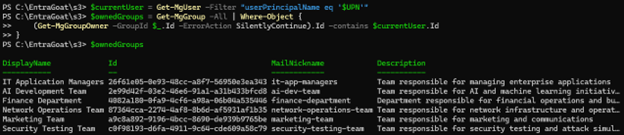
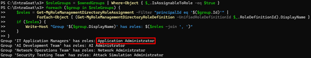
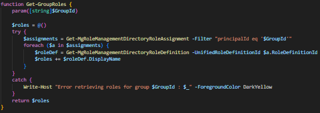
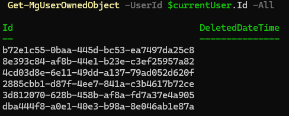
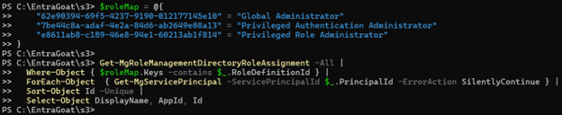
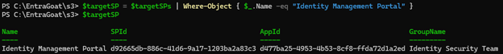
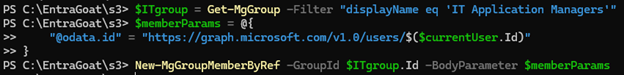
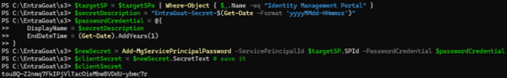
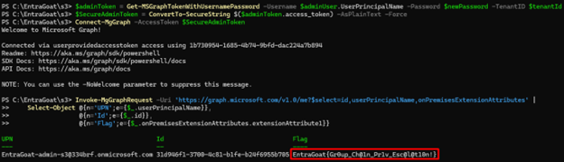

## Group MemberShipwreck – Sailed into Admin Waters

EntraGoat Scenario 3 demonstrates how legitimate Entra ID administrative features - group ownership, role-assignable groups, and service principal management can be chained into an unintended privilege escalation path from a low-privileged user to Global Administrator.

The attacker begins with a compromised IT support account that owns several groups, including one that is role-assignable with the **Application Administrator** role. By adding themselves to this group, the attacker inherits the role and gets broad control over applications and service principals across the tenant.

From there, by identifying a high-value service principal that is a member of another role-assignable group holding the **Privileged Authentication Administrator** role, the attacker adds a client secret to it, authenticates as the privileged service principal, and resets the Global Administrator's password.

This scenario highlights how individually legitimate Entra ID features, when combined with misconfigured group ownership, can cascade into a privilege escalation chain that elevates a low-level account into a tenant-wide threat.

### Attack path overview

1. **Initial foothold**: The attacker authenticates as Michael Chen, a compromised IT Support Specialist user who, according to the scenario’s description, “manages a few security groups”.
2. **Enumeration**: The attacker discovers ownership of six groups, including one role-assignable group called IT Application Managers that holds the Application Administrator role.
3. **Privilege escalation**: The attacker adds themselves to the security group to inherit the privileged role.
4. **Service principal targeting**: With the Application Administrator directory role, the attacker identifies the Identity Management Portal service principal as a member of a group with the Privileged Authentication Administrator role and adds a client secret to it.
5. **Pivoting:** The attacker authenticates via the client credential grant OAuth2 flow as the compromised service principal with the newly added secret.
6. **Account compromise**: Using the service principal’s inherent privileges, the attacker resets the Global Administrator’s password, authenticates as the GA, and retrieves the scenario flag.

### Attack flow

### Why This Attack Works?

This scenario chains together several legitimate Entra ID features that, when misconfigured, create an escalation path:

* **Group ownership**: Entra ID’s group ownership model grants extensive control over membership and properties. While intended to delegate administrative tasks, it becomes risky when applied to role-assignable groups or granted to inappropriate users since an owner can directly add themselves (or any controlled account) to the group and inherit its assigned roles.
* **Role-assignable groups**: Role-assignable security groups allow administrators to assign directory roles to groups rather than individual users, simplifying role management at scale by making any member of the group automatically receive the assigned roles. When combined with group ownership permissions, this creates a privilege escalation pathway where group owners can effectively grant themselves the roles assigned to groups they control.
* **Service principal group membership**: SPs, like users, can be members of security groups and inherit any roles assigned to those groups. This design enables administrators to manage application permissions through group membership rather than individual role assignments. However, **SPs present unique attack surfaces that regular Entra ID users don't**:
  + They can be compromised through ownership relationships (as seen in Scenario 1).
  + They are subject to application-management controls – identities with the built-in Application Administrator or Cloud Application Administrator roles, custom roles that include the microsoft.directory/applications/credentials/update or microsoft.directory/servicePrincipals/credentials/update actions, or service principals with the Application.ReadWrite.All permission can add or modify SP credentials.
  + They can be managed programmatically through APIs and automation workflows.
  + Unlike user identities, they cannot be assigned as PIM-eligible; they can only have active role assignments (which may be time-bound). When an SP is in a role-assignable group, its access bypasses PIM’s just-in-time activation controls, providing always-active role membership during the assignment window.
  + They can authenticate in an app-only context (OAuth2 client-credentials) using a client secret or certificate, which bypasses user-centric controls such as interactive MFA and interactive Conditional Access requirements.

These additional mechanisms create more potential vectors for gaining unauthorized access to any privileged SP that holds privileged group memberships.

* **Application Administrator scope**: The role provides broad control over application registrations and SPs, including the ability to add authentication credentials (secrets and certificates) to applications in the tenant, creating opportunities for attackers to backdoor high-value SPs that aren’t configured with app instance lock.

Each of these Entra ID features is legitimate and necessary for administrative delegation, but in combination, they create unintended privilege escalation paths that can elevate a low-privileged identity all the way to Global Administrator.

How to Detect and Defend Against Group Ownership Misuse

**Monitoring group ownership is a fundamental security requirement in any Entra ID environment.** Owners can manage membership, change group properties, and indirectly control any directory roles assigned to their groups. Without clear visibility into ownership relationships and role assignments, privilege escalation paths through role-assignable groups can remain concealed from both defenders and auditors.

Defenders should monitor and correlate:

* Which role-assignable groups exist in the tenant?
* What directory roles are assigned to these groups?
* Who owns them and what business justification exists for that ownership?
* Do any unprivileged users own groups with privileged role assignments?
* Which service principals are members of role-assignable groups?
* Are there unused or orphaned groups that can be decommissioned?

Semperis solutions help close gaps in understanding these questions with multiple layers of defense starting with indicators of exposure (IOEs) and indicators of compromise (IOCs).

These indicators automatically detect and alert on dangerous defaults and misconfigurations - such as role-assignable groups with inappropriate owners, service principals with dangerous permissions, and weak group governance baselines that enable privilege escalation through group membership manipulation.

## Scenario deep dive - step-by-step solution walkthrough

You can find the full walkthrough and accompanying commands in the EntraGoat GitHub repository under [solutions/EntraGoat-Scenario3-Solution.ps1](https://github.com/Semperis/EntraGoat/blob/main/solutions/EntraGoat-Scenario3-Solution.ps1).

### Step 1: Initial foothold

We begin Scenario 3 with access to a compromised low-privileged user named **Michael Chen**, an IT support specialist. The background story tells us Michael owns several security groups - a misconfiguration that sets the stage for escalation.

We authenticate with his credentials using **Connect-MgGraph** and then run **Get-MgContext** to confirm our current security context.

### Step 2: Enumeration

Next, since the hint points us in this direction, we enumerate all groups owned by the current user:

We discover that he owns 6 groups in total. To assess privilege escalation potential, we check whether any of them are role-assignable and actually have roles assigned:

One group immediately stands out: **IT Application Managers**, which holds the **Application Administrator** role.
This role is powerful as it grants full control over all application registrations and service principals in the tenant, including the ability to add secrets or certificates to any 3rd party applications (in case they aren’t configured with app instance lock). Then, the attacker can use the SP identity to authenticate to the tenant via the OAuth 2.0 client credential grant flow, operating in an **app-only context** that bypasses user-centric protections.

\_\_\_\_\_\_\_\_\_\_

**Note:**

The enumeration steps above can be wrapped into dedicated helper functions (for example, **Get-GroupsOwnedBy** for ownership and **Get-GroupRoles** for assigned roles) to make the process more interactive and verbose, similar to how open-source tools present results. The implementation:

Here’s how the flashy output looks like when we run this enumeration function with the current user’s ID:

While this can be helpful in large environments, Microsoft Graph also provides a far more efficient cmdlet: **Get-MgUserOwnedObject**

**Get-MgUserOwnedObject** enumerates **all directory objects owned by a user**, eliminating the need to query each object type (groups, devices, apps and SPs) individually, unlike how we intentionally implemented. The command can be tweaked a bit with Sonnet to get a nicer output:

The command **Get-MgUserOwnedObject** typically makes **one API request** to https://graph.microsoft.com/v1.0/users/{userId}/ownedObjects (maybe 1-2 more in case of pagination), with the rest handled by local PowerShell logic to process, extract, and format the response.

By comparison, the **Get-GroupsOwnedBy** function we created, which might be more interactive and user-friendly, makes **100-1000x API requests** even though it only checks for one type of owned object.

When selecting enumeration tools, it’s always a good idea to prioritize efficiency - **Fewer API calls mean** fewer logs and **a smaller detection footprint.** There are many awesome (and some less-awesome) open-source tools for enumerating Entra ID environments. The key point is that although tools can be useful shortcuts, they should never be used as black boxes. If you can read the source code, do it. Take the time to understand how the queries are constructed, what API endpoints are being hit, and what data is actually being returned. Tools are only as effective as the operator’s understanding of their methods and limitations (:

\_\_\_\_\_\_\_\_\_\_

### Step 3: Building the attack chain

Owning a group with **Application Administrator** rights presents significant privilege escalation potential, because once we add ourselves as a member, we can manage (== add a client secret to*) any* service principal in the tenant, which opens multiple routes to tenant compromise.
But adding ourselves right now would be noisy and unnecessary from an OPSEC perspective. First, we should confirm there is a **privileged SP** we can leverage to reach the next chain on the attack – the GA role. *Time to hunt for high-value SPs.*

\_\_\_\_\_\_\_\_\_\_

**Note:**For this walkthrough, we’ll keep the spotlight on enumerating SPs with privileged roles that can reset the GA’s password with only a few steps:

* Privileged Role Administrator (PRA)
* Privileged Authentication Administrator (PAA)
* Global Administrator (GA)

That said, in a real tenant you wouldn’t want to stop there. It’s just as important to enumerate SPs with other roles and with **powerful app permissions,** as those can open up equally dangerous escalation paths, as seen in Scenario 2.

\_\_\_\_\_\_\_\_\_\_

We’ll start by using the function **Get-MgRoleManagementDirectoryRoleAssignment** to check if any SPs are directly assigned privileged roles:

Result? Nothing. Not a single service principal is directly holding GA, PRA or PAA in my tenant.

But **that’s not the full set of SPs that might have privileged roles assigned**. Entra ID allows role-assignable groups, and just like users, SPs can be members of those groups. If a group has GA, PRA or PAA, then any SP inside it inherits those privileges. This is an often-overlooked escalation vector.

So, next, we enumerate all groups that are role-assignable and check which ones have the roles assigned (it's not the most aesthetic code, but it will do the job):

Now that we have a list of privileged groups, we need to inspect their **members**. Since the function **Get-MgGroupMember** operates on v1.0, it doesn’t show SP memberships. To solve that, we’ll wrap a direct call to the /beta endpoint in a helper function:

Now we can use it to filter for SP membership in the privileged groups:

Now things get interesting – we discovered potential SPs with privileged roles. Depending on your environment, you may have many more.

We can simply pick the first one **($targetSPs[0]),** but for the sake of consistency (and so every player has the same path without risking tenant stability), we’ll zero in on the **Identity Management Portal**. That one is part of the setup script and won’t break anything in case of a change in functionality *(fingers crossed)*.

At this stage, we’ve mapped out the full attack chain. Here’s how we’ll move from the current low-priv user all the way to Global Admin:

1. Add ourselves to the **IT Application Managers** group to inherit the **Application Administrator** role.
2. Use that role to add a client secret to the **Identity Management Portal** service principal.
3. Authenticate as that service principal.
4. Use its inherited PAA privileges to reset the Global Admin’s password.
5. Log in as the Global Admin with the new password.
6. Retrieve the flag to prove compromise.

### Step 4: Executing the attack path

First, we add ourselves as members to the **IT Application Managers** group:

Since tokens don’t update automatically, we can disconnect and reauthenticate to pull a fresh access token with the new assigned role. As discussed in Scenario 2, this step is not a must, as most Entra ID endpoints usuallyevaluate role assignments dynamically.

We can use the **parse-JWTToken** cmdlet by BARK to see the added app admin role (**wids** field within the JWT token) assigned to the user.

With **Application Administrator** rights at our hands, we can add backdoor access to the **Identity Management Portal** like we did in Scenario 1:

That gives us persistent SP access, independent of any user account. We can use it to authenticate as the SP to Entra ID:

The next step is to find the target GA user and reset its password:

Finally, we can authenticate as the GA and retrieve the flag. We’ll use **Get-MSGraphTokenWithUsernamePassword** to authenticate from the CLI (just like in scenario 2), but you can also set a TAP (like in scenario 1) and log interactively from the Azure portal or the Entra ID admin center.

Scenario 3 completed!

### Step 5: Cleanup

Don’t forget to run the cleanup script to revert the tenant environment back to its original state:

## Conclusion

Scenario 3 reveals how seemingly minor misconfigurations in group ownership can cascade into full tenant compromise. The attack chain (from low-privileged user to Global Administrator) required no sophisticated techniques, just an understanding of Entra ID's delegation model, how role inheritance works, and the control plane of service principal identities.

The key takeaway: group ownership is administrative delegation in disguise**. When users own role-assignable groups, they effectively control any roles assigned to those groups.** Service principals amplify this risk because they can be compromised through multiple pathways beyond traditional credential theft - ownership relationships, application management roles, and programmatic access.

The scenario shows that in modern cloud identity environments, privilege escalation paths are rarely linear. They weave through ownership relationships, group memberships, and service principal identities in ways that **require defenders to think systematically about identity relationships rather than individual permissions**. The low-privileged IT support specialist didn't need to break anything - the escalation path was built into the tenant's configuration from the get-go.

**Endnote**

1. https://github.com/BloodHoundAD/BARK

**Disclaimer**

This content is provided for educational and informational purposes only. It is intended to promote awareness and responsible remediation of security vulnerabilities that may exist on systems you own or are authorized to test. Unauthorized use of this information for malicious purposes, exploitation, or unlawful access is strictly prohibited. We do not endorse or condone any illegal activity and disclaims any liability arising from misuse of the material. Additionally, We do not guarantee the accuracy or completeness of the content and assumes no liability for any damages resulting from its use.