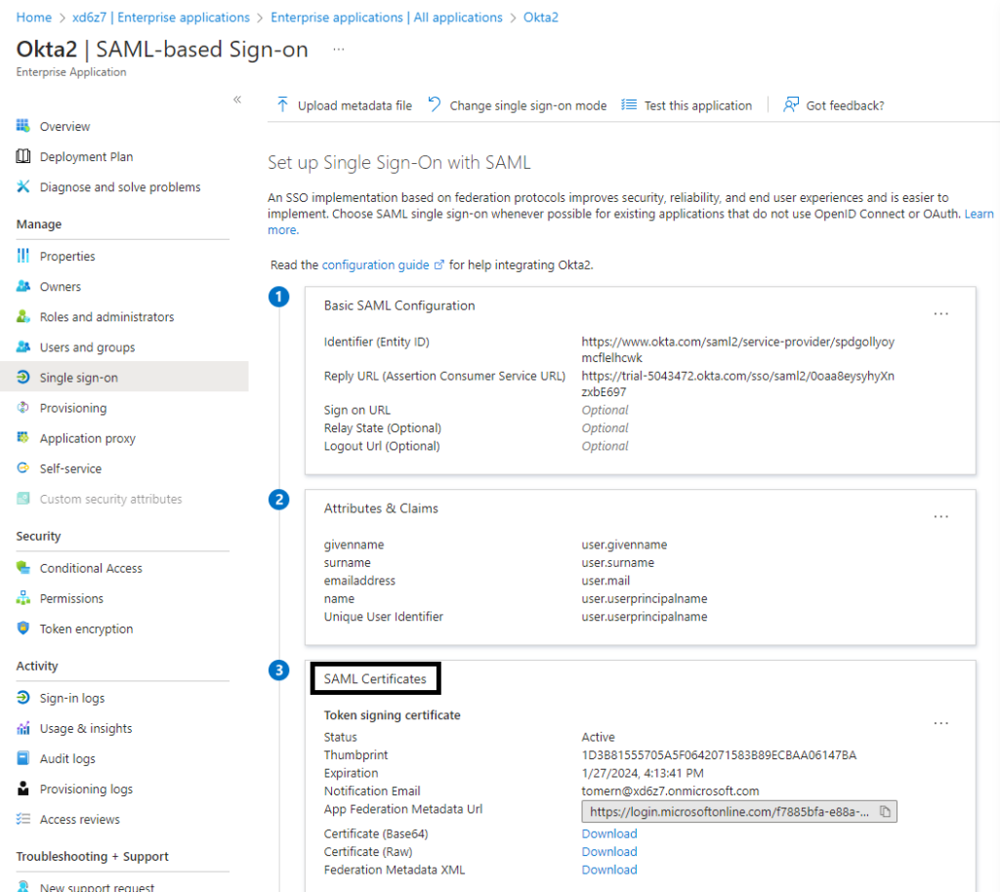

# Key Findings

* Golden SAML, an attack technique that exploits the SAML single sign-on protocol, was used as a post-breach exploit, compounding the devastating SolarWinds attack of 2020, one of the largest breaches of the 21st century.
* The supply chain SolarWinds attack affected thousands of organizations around the world, including the US Government. Attackers deployed malicious code into the company’s Orion IT management and monitoring software.
* In the wake of this attack, CISA and cybersecurity experts encouraged organizations with hybrid identity environments to move SAML authentication to a cloud identity system such as Entra ID.
* Tomer Nahum and Eric Woodruff have discovered a new application of Golden SAML, one that can be exploited even in organizations that have followed previous security recommendations meant to defend against Golden SAML.
* The new attack technique, dubbed Silver SAML, enables the exploitation of SAML to launch attacks from an identity provider like Entra ID against applications configured to use it for authentication, such as Salesforce.
* To our knowledge, no attacks using Silver SAML have been reported.
* We rate this vulnerability as Moderate, with a potential increase to Severe.

Golden SAML is a known attack technique discovered by CyberArk and [published by Shaked Reiner](https://www.cyberark.com/resources/threat-research-blog/golden-saml-newly-discovered-attack-technique-forges-authentication-to-cloud-apps). (Remember Golden SAML attack that compounded the damage from the SolarWinds cyberattack, aka Solorigate?) For years, Golden SAML has been known for its extraction of signing certificates from Active Directory Federation Services (AD FS) and its use of those certificates to forge SAML authentication responses. Today, we present a new application of Golden SAML—in Microsoft Entra ID and without the use of AD FS. **Meet Silver SAML.**

## What is Silver SAML?

Today, many organizations use Entra ID as the identity provider (IdP) for software-as-a-service (SaaS) and line-of-business (LOB) applications. SAML is the primary means of authentication for these applications.

Within Entra ID, Microsoft provides a self-signed certificate for SAML response signing. Alternatively, organizations can choose to use an externally generated certificate. However, that option introduces a security risk.

Any attacker that obtains the private key of an externally generated certificate can forge any SAML response they want and sign that response with the same private key that Entra ID holds. With this type of forged SAML response, the attacker can then access the application-as any user.

**The proof of concept discussed in this post focuses on Entra ID. But this attack can take advantage of any IdP that allows the import of externally generated SAML signing certificates**.

For the sake of this proof of concept, we built and published a new tool, called ***SilverSAMLForger,*** that can be used to forge signed SAML responses. You can [find SilverSAMLForger on GitHub](https://github.com/Semperis/GoldenCamelForger).

## Background: SAML, Golden SAML, and the SolarWinds attack

SAML is a staple of modern authentication. For example, 63 percent of Entra ID Gallery applications rely on SAML for integration. Multi-cloud integrations with Amazon Web Services (AWS), Google Cloud Platform (GCP), and others rely on SAML. And many organizations continue to invest in SAML for SaaS and LOB applications because of the simplicity of its implementation.

### Golden SAML and Solorigate

As part of the global supply chain attack on SolarWinds (aka Solorigate), Golden SAML was one of the attackers’ more innovative attack vectors.

The attackers gained initial access to SolarWinds by inserting malicious code into the company’s Orion Platform, used for infrastructure monitoring and IT management. Later, the attackers used this foothold to move laterally into the AD FS environment. From there, they stole the private key material used to sign SAML responses.

As a result of this post-breach Golden SAML attack, many organizations prioritized the move of applications to Entra ID for SAML authentication. This change removed the need to manage a complex Tier 0 infrastructure, and SAML signing keys cannot be exported from Entra ID. Even CISA recommends that organizations with hybrid identity environments move SAML authentication to cloud identity systems such as Entra ID.

### The trouble with SAML and signing certificates

Unfortunately, many organizations mismanage signing certificates and weaken SAML security by using externally generated certificates. From our observations, enterprise organizations tend to:

* Generate self-signed signing certificates on a client system
* Generate signing certificates through an enterprise public key infrastructure (PKI), such as Active Directory Certificate Services (AD CS)
* Obtain and use signing certificates from an external certificate authority (CA)

Adding to the problem, we then see organizations that take these externally generated certificates and:

* Send certificate PFX files and passwords through insecure channels such as Teams or Slack
* Generate certificates on client machines, leaving the certificates available for export in the machines’ local certificate store
* Generate certificates on web servers, typically running Microsoft Internet Information Services (IIS), leaving the certificates available for export in the machines’ local certificate store

Even for organizations that use services such as Azure Key Vault—a more secure method for secret and certificate management—attack vectors can exist. (We will cover those vectors in the next section.)

Using an externally generated certificate for SAML response signing greatly increases the attack surface of any IdP, including Entra ID. We have observed several common lessons in organizations that generate and manage SAML signing certificates externally, rather than directly within Entra ID.

* Lack of a chain of trust with self-signed certificates from Entra ID
* Inability to leverage certificate revocation with self-signed certificates
* Need to apply a defined corporate policy blindly to certificate management (usually based on one or both of the previous reasons)
* A subjective feeling that self-signed certificates are “less secure”

Additionally, some organizations want to maintain a SAML signing certificate lifetime longer than the Entra ID default. These organizations issue external certificates, not realizing that they can simply issue new certificates from Entra ID and configure those certificates to have a longer lifetime.

Many organizations do not understand the nuances of leveraging certificates for SAML signing; signing certificates are simply swept up into their broader certificate management directives and policies. Although common certificate lifecycle and management practices are important to many types of systems, they do not and should not apply to certificates that are used for SAML signing.

A chain of trust is not relevant in SAML. Most IdPs and Service Provider (SP) applications ignore any chain of trust. Unlike the server/client scenario you see with web browsers, an administrator is effectively an essential part of the chain of trust in SAML configurations. The administrator must configure and specify which signing certificate to trust, specifically in the application.

Nor is certificate revocation a relevant practice with SAML. If a signing certificate is compromised, an administrator must rotate (i.e., replace) that certificate in the SP and IdP. [OASIS SAML 2.0 Metadata Interoperability Profile Version 1.0](https://docs.oasis-open.org/security/saml/Post2.0/sstc-metadata-iop.html) specifically indicates to refrain from using revocation lists, Online Certificate Status Protocol (OCSP), or other mechanisms for key validation. Instead, you should have the IdP remove compromised keys from the SAML metadata.

### Importing external certificates

As Figure 1 shows, you can configure self-signed certificates on an enterprise application (Okta, in this example) in the Entra admin center via the application’s **Manage** > **Single sign-on** > **SAML** > **SAML Certificates** settings.



*Figure 1. Configuring self-signed SAML certificates on a service principal in Entra ID [SSOPage.png]*

In the **SAML Signing Certificate** pane, you can import your own certificate to sign the SAML response or assertions (Figure 2).


*Figure 2. Importing SAML certificates on a service principal in Entra ID* [CertificatePage.png]

## What about Azure Key Vault?

We need to take a moment to talk about Azure Key Vault: one of the places where self-signed certificates might be stored. We wanted to determine whether an attacker could extract keys from Key Vault. Spoiler: They can. (If your organization does not use Key Vault, feel free to jump to the next section.)

Azure Key Vault is a popular key-management solution provided by Microsoft. Key Vault enables you to securely store and manage secrets, encryption keys, and certificates.

As with most cloud services, Key Vault has two planes that govern access and management: the control plane and the data plane.

* **Control plane.** Roles and permissions assigned to the control plane are associated with administrative tasks and Key Vault configuration settings. Users, groups, or service principals that are assigned control plane permissions can configure access policies, create key vaults, and perform other management tasks. Rights can be granted granularly to an individual vault but are often granted at the resource group, subscription, or management group level.
* **Data plane.** The data plane relates to the actual data stored in a key vault: secrets, keys, and certificates. Rights assigned on the data plane control which users or service principals can read and write cryptographic material to and from the key vault. These rights include the ability to read certificate private keys, which is a concern if those keys are used for SAML response signing.

Key Vault permissions can be granted through role-based access control (RBAC) or Key Vault access policies.

### The RBAC permissions model

With the RBAC model (Figure 3), any user that holds one of the following RBAC roles can retrieve a key vault’s certificate.

* **Key Vault Administrator**
* **Key Vault Certificates Officer**
* **Key Vault Data Access Administrator.** This role enables you to manage access by adding or removing role assignments. Therefore, you can assign the Key Vault Administrator or Key Vault Certificates Officer role to any entity.
* **Key Vault Contributor.** This role does not grant data plane permissions but enables you to update the key vault’s access policy if the access policies permission model is also used.


*Figure 3. Specifying roles in Azure Key Vault* [KeyVaultIAM.png]

Figure 4 shows an example of the permissions that are granted to the Key Vault Administrator role.


*Figure 4. Key Vault Administrator role permissions* [KeyAdminPerms.png]

A person who holds the Key Vault Contributor role, which has no data plane permissions to access the key vault secrets and certificates, can still extract them if access policies are used. This role does have the **Microsoft.KeyVault/\*** control plane permission. This permission can be translated to **Microsoft.KeyVault/vaults/accessPolicies/write**, enabling the holder to write Key Vault access policies and extract key vault secrets.

If you can add RBAC permissions at the resource group or subscription level, by gaining control of a resource group owner account or a user account that has the **Role Based Access Control Administrator** RBAC permission or any user with **Microsoft.Authorization/roleAssignments/write** permission, you can add Key Vault permissions. The key vault will then inherit those permissions. As mentioned earlier, some RBAC roles can also directly modify Key Vault access policies.

Key vaults can also be accessed via Automation accounts and Managed Identities that have the required permissions.

### The Key Vault access policies permissions model

In this model, you can also grant Key Vault access permissions to a user, service, or group. You can choose between key permissions, secret permissions, and certificate permissions (Figure 5).


*Figure 5. Key Vault certificate permissions* [VaultAccessPolicies.png]

You can add access policies in the Key Vault Access policies pane (Figure 6).


*Figure 6. Adding Key Vault access policies* [KeyVaultAccessPolicies.png]

Any attacker that gains control of any user, service principal, or group that has permission to retrieve the PFX file that is used to sign the SAML assertions or responses for the attacked SP—through either RBAC or Key Vault access policies—can perform a Silver SAML attack on that SP.

## SAML and Entra ID

SAML, in its current 2.0 version, is almost 20 years old. OASIS published the protocol in March 2005. Since then, many enterprises have adopted SAML for federated authentication and web-based SSO solutions. The protocol’s primary implementation—and the use case within Entra ID—is leveraging the web browser SSO profile.

A typical SAML profile flow has three core components:

* The service provider (SP), or application; also commonly referred to as the relying party (RP) in the Microsoft ecosystem
* The identity provider (IdP), which in our proof of concept is Entra ID
* The user agent, typically a client’s (end user’s) web browser

Users interact with applications for authentication in various ways, depending on whether the application is configured for or supports SP-initiated or IdP-initiated flows.

In an SP-initiated flow (Figure 7), the following sequence occurs:

1. The user browses to a URL for the application (SP).
2. The SP generates a SAML request (Figure 8) and redirects the user to Entra ID (IdP).
3. Entra ID consumes the SAML request.
4. If the user has not yet authenticated to Entra ID, the user is prompted for authentication.
5. The user successfully authenticates to Entra ID.
6. Entra ID generates a SAML response (Figure 9) and redirects the user to the SP.
7. The SP verifies the SAML response.
8. The user receives access to the application.


*Figure 7. SP-initiated flow diagram*


*Figure 8. Example of a SAML authentication request* **[SAMLRequest.png]**


*Figure 9. Example of a SAML response* [SAMLResponseExample.png]

In an IdP-initiated flow (Figure 10), the following sequence occurs:

1. The user browses to myapps.microsoft.com.
2. If the user has not yet authenticated to Entra ID, the user is prompted for authentication.
3. The user successfully authenticates to Entra ID.
4. Entra ID provides a list of applications available to the user in myapps.microsoft.com.
5. The user selects the target application.
6. Entra ID generates a SAML response and redirects the user to the SP.
7. The SP verifies the SAML response.
8. The user receives access to the application.


*Figure 10. IdP-initiated flow diagram*

The contents of a SAML assertion includes several bits of information about the end user, or subject, in a series of key-value pairs. This information is often referred to as *SAML claims* and includes information such as:

* **The subject.** The application uses this required component as the user’s unique identifier. In many implementations, the subject is the user’s User Principal Name (UPN) or email address.
* **Attribute information.** This information might include the user’s given name, surname, email address, and display name. Group membership or roles are often provided so that the application can make authorization decisions about which rights the user should have.
* **Other authentication contextual information.** This information might include the type of authentication used, the issuer and audience, and timestamp information that indicates the window of validity for the SAML response.

How do you ensure that the SAML response, which is handled by the user, has not been tampered with? This is where signing comes into play.

Entra ID supports both SAML response and SAML assertion signing. At a high level, the purpose of both response and assertion signing is to verify that the contents of the response have not been tampered with and that the application can trust the information in the response. The application uses the signature to validate that the response was generated by the IdP, which holds the private key used to sign the response.

This is why theft of the signing private key is a critical issue. With the signing key in hand, a threat actor can forge a copy of a SAML response, performing a Silver SAML attack.

## Performing a Silver SAML attack

To test the theory that the Golden SAML attack technique can be turned against Entra ID—in what we have dubbed a Silver SAML attack—we built the SilverSAMLForger tool. This tool generates a SAML response that duplicates an Entra ID response, signing that response with a provided certificate.

Our Silver SAML proof of concept is built on the premise that an organization is using an externally generated signing certificate, which an attacker has obtained by using one of the previously discussed methods. We look at applying Silver SAML in both SP-initiated flows and IDP-initiated flows, as both are susceptible to attack.

### Silver SAML in an SP-initiated flow

Silver SAML attack using Entra ID as the IdP and Okta as the SP. To launch the attack in an SP-initiated flow, we needed to intercept the SAML request and replace the contents of the SAML response with the forged SAML response that we created (Figure 11). We were able to accomplish these tasks easily by using Burp Suite.


*Figure 11. Silver SAML attack in an SP-initiated flow*

For this example, we attempted to forge a SAML response for the user oktaAdministrator@xd6z7.onmicrosoft.com. This user is a Super Administrator in Okta. We do not have the user’s password or the user’s MFA connected device (if configured).

First, we needed some attributes in the SAML claims information in accordance with what was set up when the application was registered on the IdP. For example, we need the UPN, surname, firstname, displayName, and objectID. An attacker can easily find these attributes in the Entra admin center or by using the Microsoft Graph API.

We also needed to know the recipient and audience. That information was available in the Entra admin center, in the application’s **Single sign-on** pane (Figure 12).


*Figure 12. Identifying the signing recipient and audience* [SSOSettings.png]

Running SilverSAMLForger.exe with the required parameters output a base64 and URL encoded string (Figure 13). We can now copy this forged SAML response. .


*Figure 13. SAML generated response* [SAMLGeneratedResponse.png]

We copied the generated SAML response to the intercepted HTTPS request (Figure 14) and modified the response to the forged one (Figure 15).


*Figure 14. Copying the SAML response to the intercepted HTTPS request* [BurpRequestURL.png]


*Figure 15. Changing the SAML response* [BurpIntercept.png]

After sending the forged response, we can stop intercepting as we are now logged in as the targeted user (Figure 16). 

*Figure 16. Successful sign-in as the target user* [SuccessfulSignInOktaAdmin.png]

### Silver SAML attack in an IdP-initiated flow

IdP-initiated flows come with a much greater risk to the organization because no interaction is required with Entra ID. If the application supports IdP-initiated flows, **you can directly post a SAML response to the application** (Figure 17).


*Figure 17. Silver SAML attack in an IdP-initiated flow*

For this part of the proof of concept, we tried to perform an IdP-initiated attack against Salesforce.

We targeted the user Patti Fernandez, forging a response with her UPN as the subject. The response (Figure 17) was signed using the same SAML signing certificate that was configured for Salesforce in Entra ID.


*Figure 18. SAML response* [SalesForceForging.png] (The pictures looks a bit different from the one here cause we updated the pic)

Decoding this response, you can see that it’s a forged response for Patti (Figure 18).


*Figure 19. Silver SAML attack in an SP-initiated flow*

In Burp Suite, we used Repeater to directly post the forged SAML response to our instance of Salesforce (Figure 19).

*Figure 20. Posting a forged SAML response*

Opening the response in a browser, we verified that we are logged into Salesforce as Patti, **without any interaction with Entra ID** (Figure 20).


*Figure 21. Logging on to Salesforce with a forged SAML response*

## Defending against Silver SAML attacks

To safeguard effectively against Silver SAML attacks in Entra ID, your organization should use *only* Entra ID self-signed certificates for SAML signing purposes.

SAML signing certificates are stored in the service principal for a SAML application in Entra ID. You can use the Graph API to view the information that is exposed about the signing key. Simply call a GET request to the following URI: [https://graph.microsoft.com/beta/servicePrincipals/{serviceprincipalobjectid}](https://graph.microsoft.com/beta/servicePrincipals/%7Bserviceprincipalobjectid%7D)

Figure 22 shows an example of the exposed information. Note that the private key material is not exportable, preventing attackers from gathering the information they need to launch a Silver SAML attack.

```powershell
      {

            "customKeyIdentifier": "Gk//vUF/JYC58HRyyuGMM5ydmOuJVUL74R6OszKQn6w=",

            "endDateTime": "2026-08-08T14:19:35Z",

            "keyId": "66ad0fe4-111d-45da-924c-545913d77be9",

            "startDateTime": "2023-08-08T14:19:36Z",

            "type": "AsymmetricX509Cert",

            "usage": "Sign",

            "key": null,

            "displayName": "CN=Microsoft Azure Federated SSO Certificate",

            "hasExtendedValue": null

        }
```

*Figure 22. Exposed signing key information*

Global Administrators, Application Administrators, Cloud Application Administrators, and any user who is delegated application ownership can modify which signing keys are available, and can import an external signing key. Although the associated application will need to be updated, organizations should limit who has ownership over applications in Entra ID. At the very least, monitor for changes to SAML signing keys, especially if the key is not near its expiration.

Organizations can audit existing service principals that are configured for SAML and check the displayName. If the used certificate is generated by Microsoft, the certificate will contain the value **CN=Microsoft Azure Federated SSO Certificate**. However, nothing prevents an attacker from importing an external certificate that has the same subject name.

Organizations can also monitor Entra ID audit logs for changes to **PreferredTokenSigningKeyThumbprint** under **ApplicationManagement**. You will need to correlate those events to **Add service principal credential** events that relate to the service principal. The rotation of expired certificates is a common process, so you will need to determine whether the audit events are legitimate. Implementing change control processes to document the rotation can help to minimize confusion during rotation events.

If an application supports both SAML and OpenID Connect (OIDC) for authentication, you might consider changing the integration with Entra ID to use OIDC, mitigating this attack. The complexity of changing from SAML to OIDC largely depends on how the application developer has implemented the standards.

## On the app side, application developers can protect against attacks in a few ways. (Your options will depend on the methods and libraries used in your SAML implementation.)

* Require SP-initiated flows, which protect against IdP-initiated flows—the most dangerous types of attacks.
* For SP-initiated flows, follow the SAML specification and ensure that responses contain an **InResponseTo** value that correlates to an associated SAML request.
* Observe the time in which the application receives a SAML response. The IdP indicates a window of validity in the response, but application developers can introduce further logical limitations to the acceptable window for receiving a response in SP-initiated flows.
* Offer the choice of using OIDC, instead of SAML, for integration.

## Don’t let Silver SAML take you by surprise

Like the Golden SAML attack, Silver SAML attacks have the potential to be mild—or devastating. As the adoption of cloud and hybrid identity environments continues to grow, we expect to see more threats aimed at IdPs like Entra ID. We encourage organizations to take decisive steps now to close gaps and vulnerabilities in these environments.

## Disclosure

This issue was reported via the Microsoft Security Response Center (MSRC) on January 2, 2024. Microsoft replied on February 26, 2024: “After careful investigation, this case has been assessed as by-design and does not meet MSRC’s bar for immediate servicing. However, we have shared the report with the team responsible for maintaining the product or service. They will take appropriate action as needed to help keep customers protected.”


## Timeline

January 2, 2024: MSRC case created

January 3, 2024: Case status changed to Review/Reprod

February 17, 2024: MSRC review of research article

February 26, 2024: MSRC response received

February 29, 2024: Public disclosure