In [Dirk-Jan's talk](https://dirkjanm.io/assets/raw/TR19-Im%20in%20your%20cloud.pdf) at Troopers 19 (I’m in your cloud, reading everyone’s emails - hacking Azure AD via Active Directory), he discussed an issue he discovered that allowed a method (SMTP matching) to synchronize Active Directory (AD) users up to Azure AD to hijack unsynchronized accounts. He stated that Microsoft blocked the ability to synchronize on-prem accounts which had active assignments to administrative roles within Azure, but this sparked the following research.
This blog talks about how anyone with account creation privileges in an AD environment can modify the password of an Azure AD user which, with some pre-requisites, can obtain privileged access via Eligible role assignments.

## Background

AD is still widely used by most organizations for managing permissions and access to network resources. On top of that organizations are starting to use Azure AD, a cloud-based identity and access management service, to manage user identities and access privileges to resources such as the Azure portal, Office 365, etc.

Many of these organizations use Hybrid identity implementations, where objects are being synchronized between the on-premises AD environments and Azure AD Tenants.

By employing this Hybrid implementation users can use the same identity for both AD and AAD.

### Azure AD Connect

Azure AD connect is a Microsoft application designed and built to achieve a hybrid identity, it does so by synchronizing on-prem AD objects with Azure AD objects.

Azure AD connect encompasses many different features, the most important ones are password hash synchronization, pass-through authentication, federation integration (with ADFS), and synchronization (with Azure AD Connect Sync). We will focus on password hash synchronization and general synchronization in this blog.

When an Azure AD connect express installation is performed, new accounts will be created to support the synchronization.

1. AD DS connector account - used to read and write Active Directory and is given the Replicate Directory Changes and Replicate Directory Changes All permissions for the use of the Password Hash Sync.

This account has its name prefixed with MSOL\_########

1. ADSync service account - used for synchronization and for accessing the SQL database.
2. Azure AD Connector account – used to write information to Azure AD
   This account is prefixed with Sync\_\*
   It is granted the special role Directory Synchronization Accounts that has only permissions to perform directory synchronization tasks.

In a Hybrid Identity implementation, integrity between on-premises environments and Azure AD Tenants is important. To achieve this goal Azure AD Connect matches user objects between AAD and AD.

It does so by employing 2 different techniques:

1. Hard matching
2. Soft matching

When Azure AD connect is being set up for the first time and starts synchronizing, a source anchor attribute will be picked, this attribute uniquely identifies a user object between AD and AAD.
Azure AD Connect performs the matching by looking at the source anchor attribute.

### Hard Matching

If you let Azure manage the source anchor, Azure AD Connect (version 1.1.486.0 and older) uses objectGUID as the sourceAnchor attribute.  Azure AD Connect (version 1.1.524.0 and after) uses mS-DS-ConsistencyGuid as the sourceAnchor attribute.
When the mS-DS-ConsistencyGuid attribute isn’t populated, Azure AD Connect writes the user’s objectGUID to it.
ImmutableID is the corresponding value on the Aure AD object, it is essentially the objectGUID base64 encoded.
An example for getting the ImmutableId of an Azure AD object from the on-prem Active Directory user’s objectGUID.

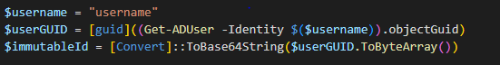

### Soft Matching

Soft matching is performed using 2 different attributes that exist in both AD and AAD,

The attributes are:

1. userPrincipalName
2. proxyAddress

Soft matching happens when user objects are matched when these two conditions apply:

1. The **userPrincipalName** attribute in AAD matches the one in AD.
2. The primary **proxyAddress** attribute in AD matches the **proxyAddress** in AAD

Whenever a hard match or a soft match succeeds the matching user object is updated, if there is no match a new user object will be created in the Azure AD tenant to match the on-prem AD user object using the account’s attributes.

### Password hash synchronization

We will keep this part briefly, for detailed explanation about the password hash synchronization process please refer to: [Semperis - Understanding Azure AD Password Hash Sync](https://www.semperis.com/blog/understanding-azure-ad-password-hash-sync/)

Password hash synchronization is an authentication method that is implemented in Azure AD hybrid identity environment. It synchronizes the hash of the user’s on-prem AD password to Azure AD every two minutes, by default password hash synchronization is enabled.
This allows users to login to Azure AD with the same password they use for their AD account.

### Active vs Eligible roles

I In Azure AD users can be assigned roles which grant permissions to manage various Azure AD resources.
Roles can be assigned as either Active assignments or Eligible assignments.

**Eligible** assignments require the user to perform an action to activate that role, In order to activate an eligible role, they must perform an action on one of the following: MFA, providing a business justification or requesting approval from approvers.
Eligible roles can be assigned permanently which means you can activate them forever or only between a time period.

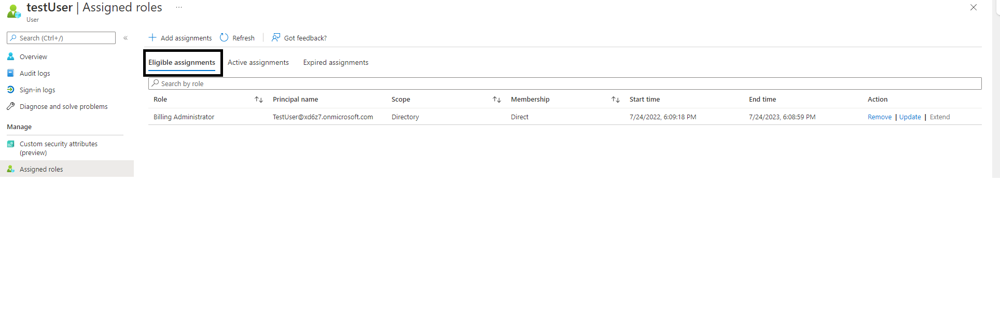

**Active** assignments don’t require the user to perform any action to use the role which means they always have the privileges assigned to that role.

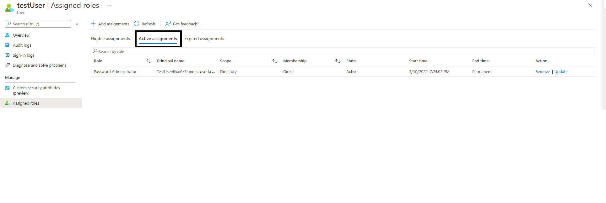

## Description

An object in Azure AD can be managed in Azure AD or in on-prem AD. Each object has a flag representing if the account has been synchronized with an on-prem account.

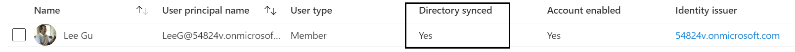

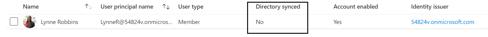

As you can see on the Azure “Users” panel, the user *Lee Gu* is “Directory synced” while *Lynne Robbins* is not.

We can also see these settings on the Office365 “Active Users” panel under “Sync Status” column.

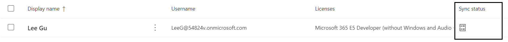

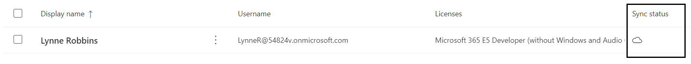

We may want to be able to transfer the source of authority for a user account that was originally authored by Office365 management tools, which means this user is cloud managed.

For example, we created the user “*Lynne Robbins*” directly from Office365, that is why she is “cloud managed”. But we want to manage her as we manage the rest of the users which is through on-prem Active Directory.

In order to do so, we can use directory synchronization to manage that account through on-prem AD.

This method uses “SMTP matching” (soft match), a process of synchronizing an Office365 user account with an on-prem user account based on the “ProxyAddress” attribute.

The required steps to synchronize accounts using SMTP matching are:

1. Create a new AD account with the same UPN (userPrincipalName) as the Azure AD account.
2. Configure “proxyAddress” attribute to match the Azure AD user’s proxyAddress attribute.

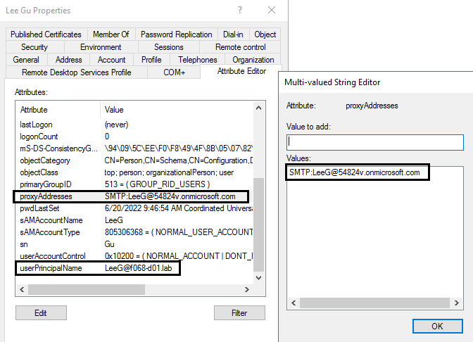

“Lee Gu” user properties on-prem. Here we are creating the user and assigning it the same ProxyAdress and UserPrincipalName as the cloud managed “Lee Gu” user.

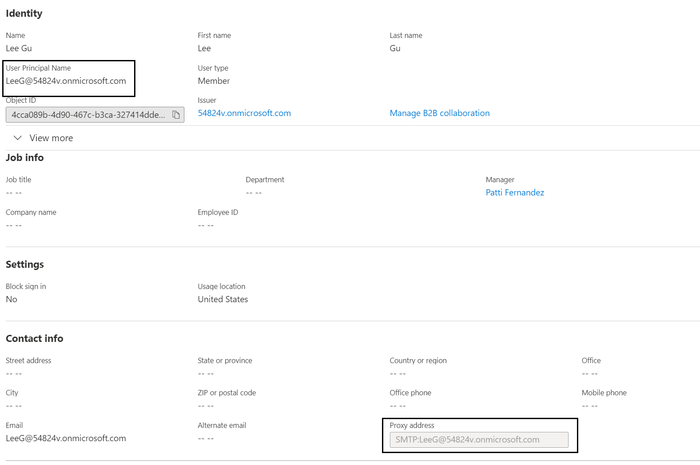

“Lee Gu” user properties on AAD.

If Azure AD connect finds an object on Azure AD with the matching UPN and ProxyAddress attributes, SMTP matching Occurs. This process overwrites the existing password for the Azure AD account with the password from the on-prem account.

Important sidenotes about the SMTP matching process:

1. The AD user must be a newly synchronized user.
2. The Azure AD user can’t be an active high privileged user, if so, the synchronization will not work (fixed after Dirk-jan found this vulnerability). For example, you can't synchronize on-prem user to an active “Global Administrator” AAD user.
3. If the UPN of the on-prem user doesn’t match the cloud-based user, then a new cloud user will be created. This user will be synchronized with the on-prem user and will have a valid office365 mail address, which will be determined by its UPN and not by the Proxy Address attribute.

For example, we will try to synchronize the following user using proxyAddress Attribute but with different UPN, which will result in a new AAD user without having any cloud access or permissions:

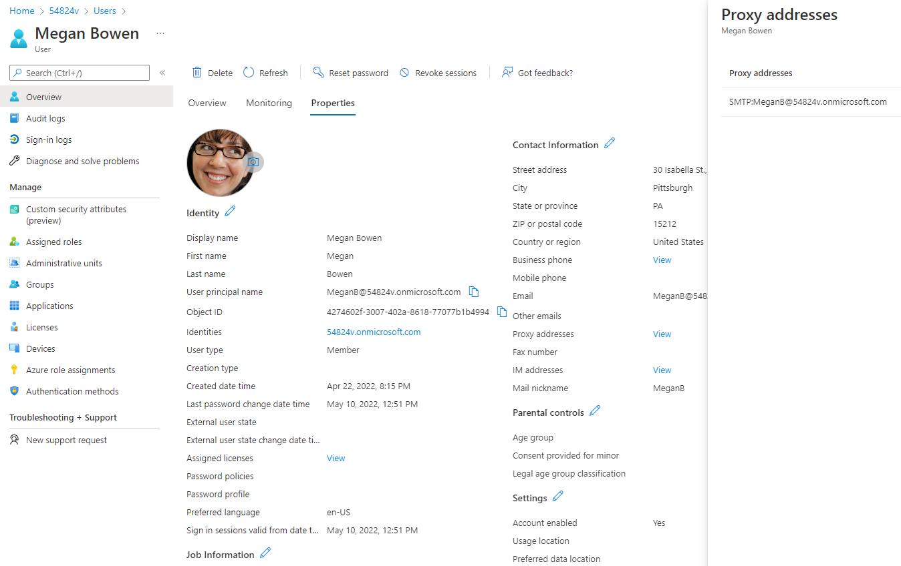

As the steps above describe, we will create a new on-prem user with the same Proxy Address attribute, but we will give it a different UPN:

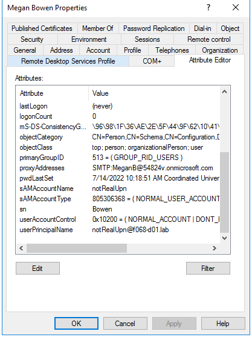

As you can see, now we have 2 users named “Magen Bowen” with different UPN. One of them is synced (the new

one) and the original one is AAD managed.

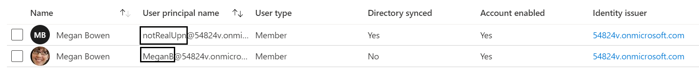

We can now login with the new cloud user that we created and the on-prem password and configure MFA:

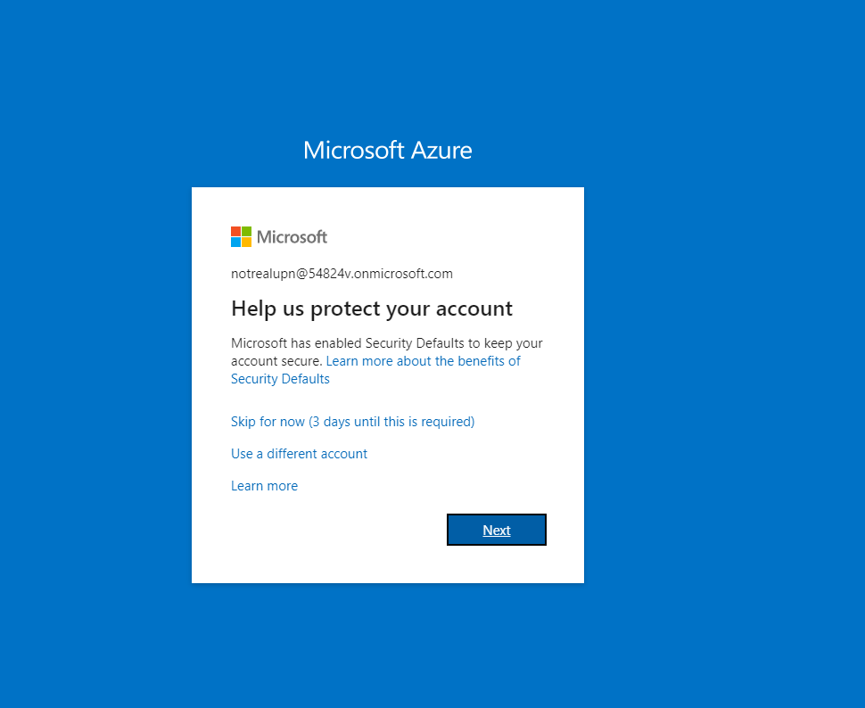

## Abuse

We found out that it is possible to sync on-prem users up to Azure AD users that are eligible for administrative roles, using SMTP match. This provides the ability for attackers with on-prem access to compromise Azure AD.

The SMTP matching process will work for high privilege users if the user Is eligible for the privilege and the privilege has not been activated.

Please note that the abuse is possible whether the administrative role has been made eligible directly to the user or via an Azure group which has been made eligible to activate the role.

To activate the role, the user will have to bypass or configure. Which means MFA is required to either be not configured or unconfigured and not required.

We created a list of all the high privileged roles that do not require MFA configured for the role to be activated. The list is at the end of this post.

For example, as we saw earlier, the user “Lidia Holloway” is cloud-based user. We can also see that this user is eligible for the “Global Administrator” role.

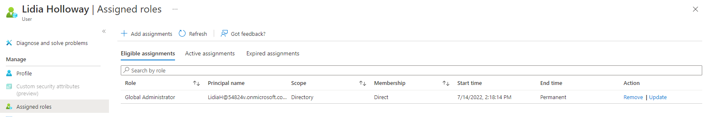

We will use “SMTP Matching” to synchronize Lidia’s user with new on-prem user.

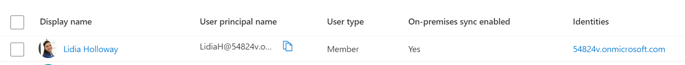

We can see Lidia is now synchronized.

After logging into Azure using Lidia’s on-prem password, the global admin role can be activated.

As we can see, to activate global admin role we need to use MFA (“Additional verification required”). If the original cloud user didn’t require MFA, we can just configure it now and activate the role.

If we try to activate a role from the list at the end of this post that does not require MFA, we could activate it without additional verification. For example, “Application Administrator” role, which can directly escalate to Global Administrator role:

1. <https://dirkjanm.io/azure-ad-privilege-escalation-application-admin>

2. <https://posts.specterops.io/azure-privilege-escalation-via-service-principal-abuse-210ae2be2a5>

## Other Detections

Another option is to Audit any synchronization and role activation in your environment using azure audit logs.

For our example, we can see the synchronization here:

We can see that the Action Client Name is “DirectorySync” and that the old value for Last Dir Sync Time is empty, which means that this is the first time this user is synchronizing with on-prem.

In addition, we can see the role activation in the following log. Using the role definition id attribute, we can search for the role that has been activated.

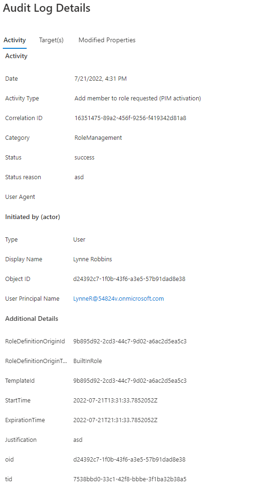

## Remediation

Microsoft recommends requiring MFA (Multi Factor Authentication) for all the users to prevent this issue under the “Harden your Azure AD Connect Server”.

mitigation is achieved by ensuring users have MFA configured PRIOR to granting them an eligible role.

<https://docs.microsoft.com/en-us/azure/active-directory/hybrid/how-to-connect-install-prerequisites#harden-your-azure-ad-connect-server>

Also, you can disable the option to use “SMTP match” for synchronization.

<https://docs.microsoft.com/en-us/powershell/module/msonline/set-msoldirsyncfeature?view=azureadps-1.0#example-2-block-soft-matching-for-the-tenant> .

## Disclosure

This issue was reported to Microsoft through MSRC on June 10th

Microsoft replied July 13th saying that: “based on our assessment, there are mitigative controls in place that a user can use to avoid this vulnerability. We determined the behavior to be by design.”
