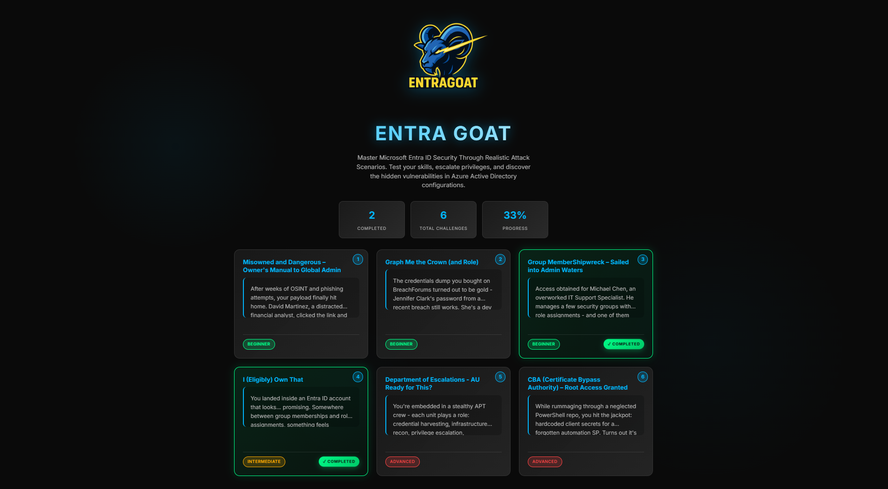
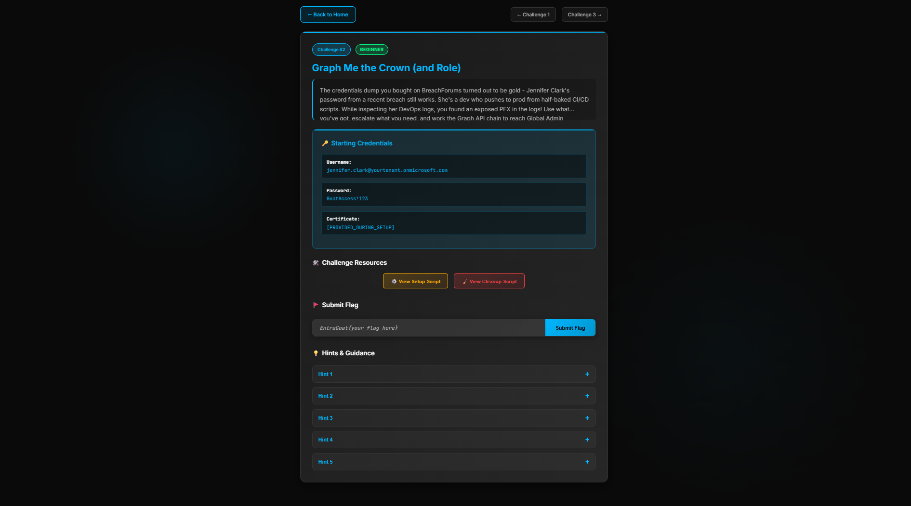

## What Is EntraGoat? A Deliberately Vulnerable Microsoft Entra ID Lab

**Meet EntraGoat: *Figure 1* shows a preview of what you’re getting into.**

Figure 1. EntraGoat start screen
## Why do identity security defenders need EntraGoat?

Modern Entra ID environments are a goldmine for attackers. Over-permissioned apps, stale group assignments, and mismanaged service principals offer more than enough to escalate to Global Administrator with a few clever moves.

EntraGoat reproduces these attack paths inside your *own* test tenant, giving you a safe and reproducible playground to learn, teach, test, or validate:

* Privileged role escalation via application ownership
* Service principal misuse with Graph API permissions
* PIM activation chains and eligible role abuse
* Dynamic administrative unit poisoning
* Passwordless persistence with Certificate Authority Forgery for impersonation of Global Administrator

## How does EntraGoat work?

EntraGoat is part CTF, part learning lab. Each challenge includes:

* A unique attack scenario with hidden flags
* Setup and cleanup PowerShell scripts (no leftovers in your tenant)
* Step-by-step hints (or alternatively, go blind and earn the goat)
* Optional walkthroughs (if you're stuck or want some hints)
* Blog post that covers the theoretical background (see the links below)

The interactive web interface (*Figure 2*) lets you track your progress, review challenge details, and submit flags—all hosted locally via React. Under the hood, each challenge is powered by PowerShell and Microsoft Graph.

*Figure 2: EntraGoat’s interactive web interface*

The goal of EntraGoat is to provide a **hands-on learning experience** through a CTF-style platform.

The focus is entirely on **Entra ID**, so each scenario starts with access to a compromised identity and skips the reconnaissance phase, instead providing a **realistic initial foothold story**.

While we considered integrating additional platforms—such as Azure Key Vault for secret extraction or SharePoint for reading flags, we intentionally left them out. The emphasis is on **identity-based attacks**, not on broader cloud infrastructure.

## Getting Your Hands Dirty

EntraGoat's beauty lies in its simplicity. With PowerShell commands and a test Entra ID tenant, you can deploy vulnerable configurations and begin exploring identity attack techniques immediately.

The platform provides both a user-friendly web interface for challenge management and direct PowerShell access for those who prefer command-line interaction. This flexibility accommodates different learning styles and technical preferences.

## Safe by Design

EntraGoat was built with safety in mind, but make sure you check the following:

* Run *only* in your test tenant
* Cleanup scripts ensure your lab stays tidy

**And always use responsibly.** This is a weaponized learning environment.

EntraGoat is our way of giving back to the security community by making identity attacks *understandable*, *repeatable*, and *defendable*.

Train like an attacker. Defend like a pro. Break stuff—responsibly.

Check it out on [GitHub](https://github.com/Semperis/EntraGoat)

**Happy Hacking!**
– The EntraGoat Team

## Endnotes

1 <https://github.com/Semperis/EntraGoat>

Disclaimer

This content is provided for educational and informational purposes only. It is intended to promote awareness and responsible remediation of security vulnerabilities that may exist on systems you own or are authorized to test. Unauthorized use of this information for malicious purposes, exploitation, or unlawful access is strictly prohibited. We do not endorse or condone any illegal activity and disclaims any liability arising from misuse of the material. Additionally, We do not guarantee the accuracy or completeness of the content and assumes no liability for any damages resulting from its use.